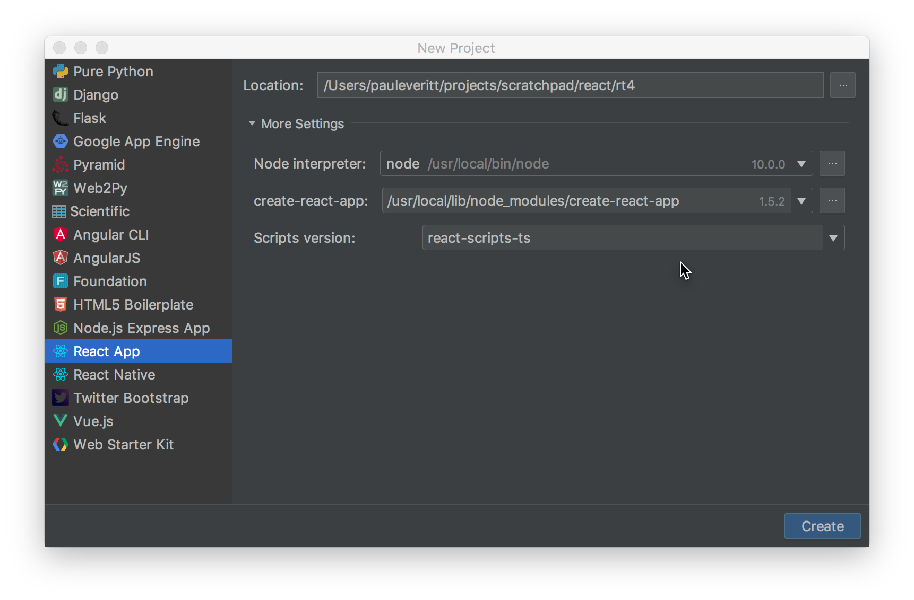
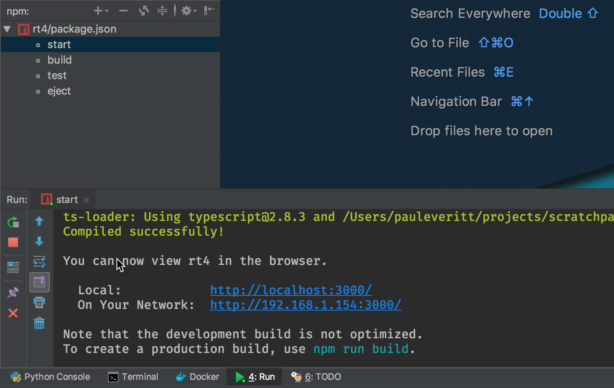
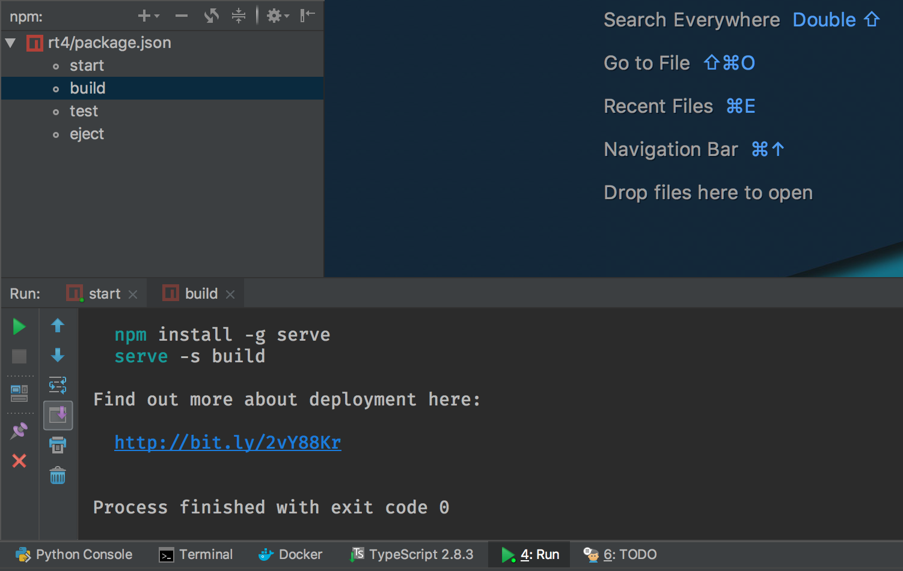
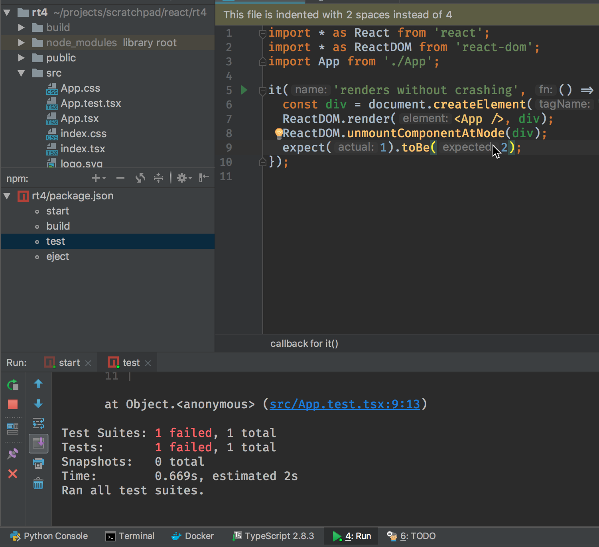

.. tutorialstep::
    published: 2018-02-25 12:00
    excerpt: Use PyCharm to create and open the project with all dependencies,
        then see some of the IDE features in action.
    full_movie:
        name: v1
        src: https://www.youtube.com/embed/9MYw8N5Vn14
        width: 800
    duration: 2m34s
    primary_reference: learn/technologies/react
    references:
        author:
            - pauleveritt
        technology:
            - react
            - nodejs
            - cra

=============
Project Setup
=============

React has become very popular, as has TypeScript. But it can be difficult to
keep your tools and build configurations up-to-date. Many frameworks have
recently built CLI (command-line interpreter) tools that make those decisions
for you, using best practices. They'll generate a project with the right
choices then update those choices as things evolve.

React's :ref:`technology-cra` takes care of this. And it's extensible
with scripts such as
`react-scripts-ts <https://github.com/wmonk/create-react-app-typescript>`_
which provides a :ref:`technology-typescript` version of the generated
project.

In this tutorial step, we use the IDE to generate the project, then look at
the results.

Code
====

The finished code for this tutorial step is
`on GitHub <https://github.com/pauleveritt/pycharm_companion/tree/master/docs/tutorials/react_typescript/project_setup>`_.

Before Starting
===============

Before anything can happen, you have to install NodeJS on your system. Then,
you have to install :ref:`technology-cra` either "globally" or somewhere
that you can point the IDE to.

PyCharm Professional integrates with :ref:`technology-cra` to generate the
new project. The IDE lets you pass an argument to the generator for the
extra script to use. We want to use ``react-scripts-ts``, a mature "fork"
of :ref:`technology-cra` which changes the output to be React+TypeScript.

If ``yarn`` is installed, :ref:`technology-cra` will choose it as the
package manager and generate a yarn-oriented project. PyCharm Professional
will respect that decision.

Project Creation
================

Start by running in ``create-react-app`` command, passing the argument to
use ``react-scripts-ts``:

.. code-block:: bash

    $ create-react-app my-app --scripts-version=react-scripts-ts
    $ cd my-app/
    $ npm start

The ``react-scripts-ts`` project has
`good documentation <https://github.com/wmonk/create-react-app-typescript#tldr>`_
about this process. As a note, the first command will take a while.

If you're in PyCharm Professional, there's UI integration for this. Create
a new project, select ``React App`` as the project type, and make sure
to expand ``More Settings``. There you can supply ``Scripts version:``
as ``react-scripts-ts``:

You now have a working React+TypeScript project, toolchain, and hello-world
style app. It's actually quite an achievement. Assembling all of this, and
*keeping* it assembled, is an incredible effort. The ``create-react-app``
and ``react-scripts-ts`` have shifted that off your shoulders, onto theirs.
Trust me, it's a big deal.

Show Me a Page
==============

Let's see this React+TypeScript page in our browser. npm scripts make
it easy to discover commands that are common to a project. The most common?
Starting the dev server, which compiles the universe, serves a page over
HTTP, and helpfully opens your browser:

.. code-block:: bash

    $ npm run-script start

.. note::

    The ``start`` script issues some warnings about ``baseUrl`` when it
    starts up. We'll handle this in later steps.

This dev server is watching for changes. If you edit a file, it will
regenerate the universe and tell the page to reload. Open ``src/App.tsx``
and change ``Welcome to React`` to ``Welcome to React TypeScript``, then
save. Your terminal shows a recompile and your browser updates.

PyCharm Professional puts a nice UI on this. Click on the ``npm`` tool icon
(usually on the left) and double click ``start`` in the listing of run
scripts. You'll get a run window at the bottom with a nice UI for showing
output and restarting. Alternatively, open ``package.json`` and click the
green play icon in the gutter by the run scripts:

Production Build
================

That's great for development, but for production, we need files on disk,
shrunk as small as possible. There's a lot of complexity behind this, but
:ref:`technology-cra` has hidden it behind an npm script:

.. code-block:: bash

    $ npm run-script build

This generates output into a ``build`` directory. The output is
self-contained, including even an ``index.html`` file. You can copy it to a
static hosting site as-is.

Running this is easy in PyCharm Professional: just click on ``build`` in the
npm tool window. As an optimization, right-click on the new ``build``
directory and ``Mark Directory As | Excluded``. This prevents the IDE from
indexing the contents of that directory, which you don't need during
development:

This Is Only a Test
===================

Projects generated from :ref:`technology-cra` are also wired for testing:
dependencies, configuration files, and sample tests. We'll see more later,
but for now, let's run the tests. Unsurprisingly, it's similar to the above:

.. code-block:: bash

    $ npm run-script test

This uses the :ref:`technology-jest` test runner. At the time of this writing,
there's an issue with test running when the project isn't under version
control. Let's fix that by changing the npm script. Edit ``package.json``
and change the ``test`` script to:

.. code-block:: bash

    "test": "react-scripts-ts test --env=jsdom --watchAll",

Double-click the ``test`` entry in the ``npm`` tool window to try again:

.. code-block:: bash

    $ npm run-script test

The tests auto-run as you edit, updating much faster once first loaded. To
see this in action, open ``src/App.test.tsx`` and add a line to the test:

.. code-block:: typescript
    :emphasize-lines: 5

    it('renders without crashing', () => {
      const div = document.createElement('div');
      ReactDOM.render(<App />, div);
      ReactDOM.unmountComponentAtNode(div);
      expect(1).toBe(2);
    });

When you save this, the test runner output tells you about the test failure.
Change the ``2`` to a ``1`` and save, and the tests pass.

As with the other run scripts, you can double-click to run the npm scripts
in an IDE tool window in PyCharm Professional. But that's the less-interesting
way to do it. We'll show in :doc:`../testing/index` the more-PyCharmic way.

Conclusion
==========

In this first step we used existing tools to generate a working
React+TypeScript project, with all the tooling configured. We also gave a
brief tour of driving this in the IDE.

In our next step we'll clean up some of the generated app, fix some of the
tooling, and take a look a little more at how TypeScript with a smart IDE
helps your productivity.

TODO

- Switch to npx instead of installing cra

- Excluding build folder...WS might do that by default later

- ``isn’t under version control``...might be fixed in react-scripts-ts if
  not link to the ticket

- Confirm that --env=jsdom is still needed

- Perhaps switch from --watchAll to something newer

