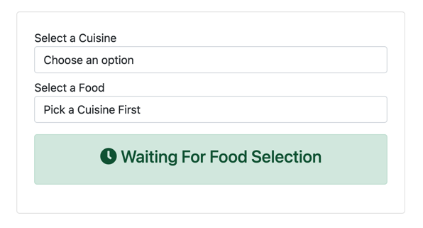
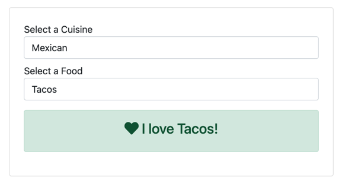

It's a typical pattern in web development to have a value in one `select` element affect the options in another. For example, you might have seen this interaction used on car shopping sites, where you can change the vehicle make to see the possible models. As common as it is to see this technique used, it can quickly become challenging to implement. What if we have multiple levels? What if the dataset is too large to include on the initial request? What if we need validation? How would you implement it with the knowledge you have today? Well, if you have no idea, then I have a solution for you.

Luckily, with HTMX, it's a _breeze_ to implement. In this sample, we'll have two levels of select elements, but could certainly be applied to more levels and larger datasets. The first select element contains types of cuisine, while the affected second select has foods within the cuisine.



Let's start with our first select element for `Cuisine`. We'll use the familiar attribute of `hx-get`. We'll be making a request and replacing the `option` elements in our second `Food` select element.

```html
<select asp-for="Cuisine" 
        asp-items="Model.CuisineItems" 
        class="form-control"
        hx-get="@Url.Page("03_Selects", "Foods")"
        hx-swap="innerHTML"
        hx-target="#foods">
</select>
```

One of the nice behaviors of HTMX, is by default, any initiated request from an input will pass along the value as a parameter. In this case, we'll be passing the selected value to our ASP.NET Core endpoint. On our Razor page, we'll need properties to capture our parameters. To do so, we'll add the following code.

```
[BindProperty(SupportsGet = true)]
public string? Cuisine { get; set; }

[BindProperty(SupportsGet = true)]
public string? Food { get; set; }
```

Continuing on the server, our implementation will generate the `option` elements based on the selected `Cuisine`. Having the values already in memory, we can filter using the value passed to our Razor page.

```c#
public IActionResult OnGetFoods()
{
    var html = new StringBuilder();
    if (Cuisine is { Length: > 0 } cuisine && cuisines.TryGetValue(cuisine, out var foods))
    {
        html.AppendLine("<option disabled selected>Select a food</option>");
        foreach (var food in cuisines[Cuisine!]) 
        {
            html.AppendLine($"<option>{food}</option>");
        }    
    }

    return Content(html.ToString(), "text/html");
}
```

I chose to generate HTML in our Razor page code to keep the moving parts to a minimum, but in later samples, we'll be using partial views. If you're feeling brave, try using a Partial view here instead. Now that our first endpoint is implemented, let's move back to our Razor page's HTML.

As a final interaction, we need to express our love for our food choices. Back in the HTML, we'll decorate our second select element with HTMX to get the final HTML output. The HTMX attributes on this select element will look very similar to our first select element but with a different endpoint value and target.

```html
<select asp-for="Food" class="form-control" id="foods"
        hx-get="@Url.Page("03_Selects", "Love")"
        hx-target="#love"
        hx-swap="innerHTML">
    <option disabled selected value="">Pick a Cuisine First</option>
</select>
```

Back in C#, let's add one final endpoint, a Razor page handler to be exact.The server-side HTML generation is much simpler this time around, outputting our final HTML snippet.

```c#
public IActionResult OnGetLove()
{
    return Content($"<span><i class=\"fa fa-heart\"></i> I love {Food}!</span>");
}
```

Running our sample, we can see changing the `Cuisine` and `Food` selections update our UI as expected. 



From here, we could use the cascading select technique to infinity, making for an epic cascading select experience. Alas, we are only human, and probably should think of our users and their sanity, but regardless, what we have already is great.

The approach outlined in this sample is one of many ways to accomplish this behavior. As you'll learn with HTMX, there usually is more than one right way to achieve your desired interaction. So, experiment with this sample and see if you can get the same behavior differently. Experiment with HTTP methods and swapping behaviors.

In the following video, we'll implement a search-as-you-type experience. 