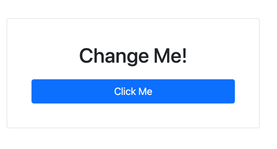

What would a video series be without a "Hello, World!" example. Starting on our page, we have a button. Our goal is to click the button and change the HTML element that says "Change Me" into displaying hello world.



From the sample's HTML, The first step is to decorate our button with the HTMX attributes of `hx-get` and `hx-target`. The `hx-get` attribute requires an endpoint value that we'll make an HTTP request of `GET` to. The endpoint will respond with a "Hello, World" HTML snippet. In this case, since the URL path is identical to our current page, thus we can leave the value empty.

The `hx-target` attribute is the destination for our HTML response. By default, HTMX swaps content into our target's `innerHTML`. The target attribute uses common CSS selectors to find an element. We can use the `#` symbol to find elements with a particular `id`. While using `id` is common, you can use any valid CSS selector to perform a swap.

Finally, we need to program the behavior in our endpoint. We want the endpoint to respond with our "hello world" HTML snippet. We do this by using HTMX.NET to return a different response depending on an HTMX HTTP header. All HTMX requests set an `HX-Request` header, which we can use to determine the originator of an HTTP request. Within our Razor Page instance, we can change the `OnGet` method to return either a fully rendered page or an HTML fragment.

We'll get more into [HTMX.NET](https://github.com/khalidabuhakmeh/htmx.net) later, but in the following example we can see one of the extension methods it provides. The `IsHtmx` call is a convenience method used to determine if an incoming occurred through the HTMX client-side library.  

```c#
public IActionResult OnGet()
{
    return Request.IsHtmx()
        ? Content("<span>Hello, World!</span>", "text/html")
        : Page();
}
```

The ternary approach allows for the same endpoint to fallback gracefully. A call to the endpoint without HTMX results in a full page render. This can occur on clients that don't support JavaScript (not common) or have it disabled. The backend style can help reduce code duplication but may come with added complexity. The alternative to this approach is to have different endpoints for HTMX behaviors and initial HTTP requests. Both are fine approaches, and you should experiment with both techniques and see which one you like better.

When done correctly, clicking the button will now change the target element. 


Congratulations! You're on your way to building HTMX and ASP.NET Core web applications. In the following video, let's see how to create a more complex sample with server-side state management.