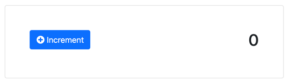

Rather than managing states on the client, HTMX relies heavily on the server to keep our state in order. Let's be honest, persisting state is a task suited best for a server back-end. While we could store state on the client, in a server environment we have secure access to a wonderful array database technologies. 

In this example, we'll be enhancing our UI to keep track of an ever incrementing number, with each user click affecting state on the server. If you've built a form-based application, this sample will be very familiar to you.

We'll start with an HTML UI that contains our button and the current state of `0` for our counter value.



In our sample project, we'll use the HTMX attributes of `hx-post` and `hx-target` to decorate our button. In general, using HTTP methods like `POST`, `PUT`, and `DELETE` for mutating requests is good practice, while we should reserve the use of `GET` for read-only requests. Like in our previous sample, we can leave the value of `hx-post` empty, as it will be posting to the same URL as our page. For the `hx-target` attribute, we'll need to set the response to our target element of `example_one_count`. When we initiate the `POST` request, HTMX will swap out the current value with our newest value.

In this sample, the server implementation is more complex than we previously saw, but not by much. The goal is to increment  a `count` variable on each user-initiated request. Once initiated, you'll store the updated value in memory. It wouldn't take much effort to store this new value a database or other storage mechanism.

```c#
public class Counter: PageModel
{
    private static int count = 0;
    
    public void OnGet()
    {
        // reset on refresh
        count = 0;
    }

    public IActionResult OnPost()
    {
        return Content($"<span>{++count}</span>", "text/html");
    }
}
```

Once the frontend and backend are complete, run the application, where we can now click the `Increment` button to see our number increase by one. Neat!


This sample shows the general idea behind HTMX. Make a request, which returns an HTML response with embedded state. In this case, the embedded state is the value of our counter. As you can imagine, while straightforward, the possibility of managing state and materializing HTML can be used to build some amazing experiences.

In the following video, let's tackle one of the more challenging UI behaviors known to developers worldwide —the dreaded cascade select.