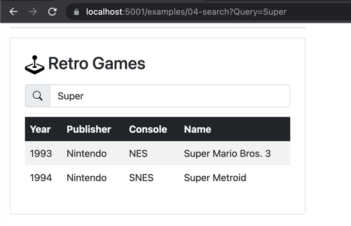

Search as you type is a user-expected staple of a modern user interface. You enter a few characters, to see the matching results so far. In this section, we'll implement a seemingly complex UX pattern, but as you'll see it's pretty straightforward to build with HTMX. While we're using an in-memory collection here, you can substitute your favorite backend search engine technology: Elasticsearch, RediSearch, or PostgreSQL.

Our initial experience starts with a humble text box. We want to pass the value of our text box to our server-based search implementation and return the relevant results. Remember, HTMX expects HTML elements in our response. This gives us an opportunity to process search results and render the response as needed. We'll be using, the familiar at this point, HTMX attributes of `hx-get` and `hx-target`, along with new attributes `hx-trigger` and `hx-indicator` to complete this solution. A new technique up to this point, We'll also be reusing our search results table by refactoring it into an ASP.NET Core partial view. As you use HTMX and ASP.NET Core in tandem, you'll utilize partial views more, and it will become a common technique. The table of results in the following image is stored in a partial view named `_Results.cshtml`.


Given our initial UI, the first step is to decorate our search `input` element with the necessary HTMX attributes of `hx-get`, `hx-target`, `hx-trigger`, and `hx-indicator`.

```html
<input type="text"
       asp-for="Query"
       id="query"
       autocomplete="off"
       hx-get="@Url.Page("04_Search")"
       hx-target="#results"
       hx-trigger="keyup changed delay:250ms"
       hx-indicator="#loading"
       placeholder="Search"
       class="form-control"
       aria-label="Username"
       aria-describedby="search-addon">
```

The most notable attribute in this collection is `hx-trigger`. The default trigger for input elements is `change`, but we have set the trigger to `keyup changed delay:250ms` . HTMX will only trigger the `change` event only if the last keystroke occurs in over 250 milliseconds. A `keyup` event resets the timer, giving us debounce behavior, allowing us to limit the number of requests we issue to the server. Next, let's look at our serverside implementation.

```c#
public IActionResult OnGet()
{
    Results = string.IsNullOrEmpty(Query)
        ? Games
        : Games.Where(g => g.ToString().Contains(Query, StringComparison.OrdinalIgnoreCase)).ToList();

    if (!Request.IsHtmx()) 
        return Page();
    
    Response.Htmx(h => {
        // we want to push the current url 
        // into the history
        h.Push(Request.GetEncodedUrl());
    });

    return Partial("_Results", this);
}
```

There are a few notable elements in the C# method:

1. The page will work with and without HTMX, making our page shareable with friends.
1. We set an HTMX header to change the URL of our current page, allowing us to maintain client state.
1. We utilize the same `_Results` partial used on initial page load.

We mentioned previously that partials are an important tool when building HTMX-powered applications. It allows us to reuse layout in HTTP and HTMX requests. Now let's look at the contents of our partial view. How complicated can it be?

```html
@model Exercises.Pages.Search
@{ ArgumentNullException.ThrowIfNull(Model); }

@if (Model.Results is {} games)
{
    @foreach (var game in games)
    {
        <tr>
            <td>@game.Year</td>
            <td>@game.Publisher</td>
            <td>@game.Console</td>
            <td>@game.Name</td>
        </tr>
    }
}
else
{
    <tr>
        <td colspan="4">No Results for "@Model.Query"</td>
    </tr>
}
```

Wow! Not complicated at all! It's the same Razor syntax we know and love. In this case, we're even able to use the same `PageModel` that informs our initial page load. One of HTMX's greatest strengths' comes from an intended side effect: The ability to use our favorite server-side rendering technologies to support client-side experiences. In the case of ASP.NET Core devs, using the Razor View Engine to its fullest capabilities. Let's test out the sample!



We can see the relevant results by typing a known value into the search input. We can also see the URL in our browser change whenever we stop typing a value—a fantastic progressive enhancement with a few HTMX attributes and reworking of our C# code. The experience we've built allows for both a realized client-side experience, and a shareable experience ideal for social media, search engines, and more.

Speaking of social media, In the following video, we'll explore infinite scrolling patterns with HTMX and ASP.NET Core, a pattern commonly used on social media sites.