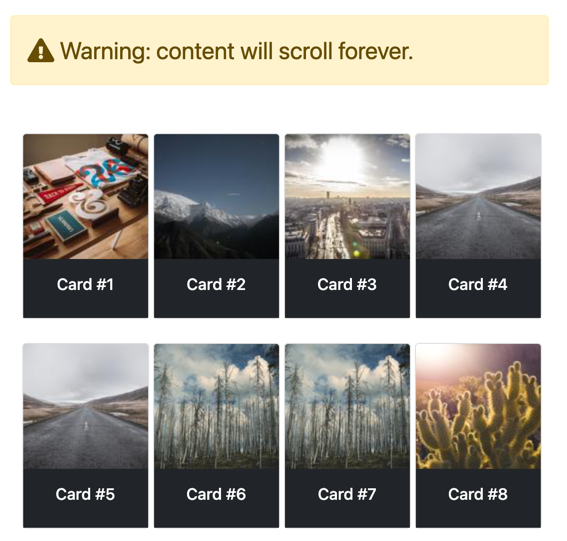

Infinite scroll patterns are popular on social media sites, where the app represents content as a continuous stream of information. As a user, you'll likely never see the beginning or end of the stream, but you can scrub through a short window of the entire stream. If you're interested in implementing this pattern, well, you're in luck. 

So far in this video series, we've covered the most common triggers of `click` and `change`, but HTMX has [so many more options](https://htmx.org/attributes/hx-trigger/). We'll also be using the `hx-swap` value of `afterend` to keep our scrolling going and going and going. By the end of this section, our goal is to have an infinite collection of cards visible in our UI.

Let's start by looking at the C# implementation of the Razor page. If you've completed the previous samples, you'll notice the code looks somewhat familiar.

```c#
public class Scroll: PageModel
{
    [BindProperty(SupportsGet = true)] 
    public int Cursor { get; set; } = 1;
    
    public IActionResult OnGet()
    {
        return Request.IsHtmx()
            ? Partial("_Cards", this)
            : Page();
    }
}
```

Remember, the ternary design is to support both the initial page load and subsequent requests to the same endpoint. I prefer this approach, but you could also separate the two behaviors of "full page load" and "partial page load" into distinct endpoints. 

As you may have noticed, we have a partial view of `_Cards`. Let's take a look at the Razor view.

```html
@model Exercises.Pages.Scroll
@{
    ArgumentNullException.ThrowIfNull(Model);
    var end = Model.Cursor + 19;
}

@for (var i = Model.Cursor; i <= end; i++)
{
    <div
        class="card mb-4 ms-1" aria-hidden="true"
        @if (i == end)
        {
            // conditional attributes
            <text>
                hx-get="@Url.Page("05_Scroll", new {cursor = end + 1})"
                hx-trigger="revealed"
                hx-swap="afterend"
            </text>
        }>
        
        <div class="card-body bg-dark text-white">
            <div class="h6 card-title text-center ">
                Card #@i
            </div>
        </div>
    </div>
}
```

For the sake of this demo, we're faking paging. Every request will generate a new set of elements from a `Cursor` value. Once we have the items, we loop through them, rendering our cards. Substitute your favorite database and paging mechanism if you're feeling adventurous. We need to trigger the next page load, and prime the trigger by adding HTMX attributes to the *last* card in the current page's collection.

```html
hx-get="@Url.Page("05_Scroll", new {cursor = end + 1})"
hx-trigger="revealed"
hx-swap="afterend"
```

When the last card is `revealed`, meaning it has scrolled into the client view, we request to get the next set of items. Upon the response, we add the HTML payload to the end of our current set of cards. **It's important to note that HTMX will wire up any HTMX attributes as they appear in our responses.**, We can expect any HTMX definitions to work, whether they were on the initial page or our server returns them in an HTML payload. Defining HTMX attributes works consistently as long as they are defined correctly.

When completed, we can scroll our dataset forever! But please don't, we have other tutorials to get to.



This UI pattern is straightforward to implement and ultimately is as complex as your backend paging approach. You can alter the backend implementation, and also choose different scrolling behaviors to create different experiences. Scroll left, right, up, or down. The possibilities are literally endless ;).

In the following video, we'll take a look at a favorite UI pattern deployed on millions of sites, the modal.