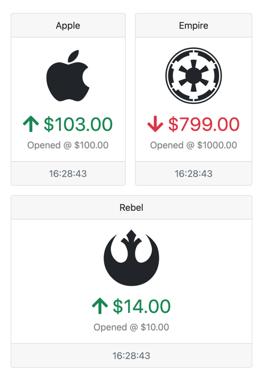

Long polling is a technique to retrieve updated information from the server at a known time interval. Upon receiving new information, you can swap it into a known target element, and a user perceives that information is updating in near real-time. The method has its advantages and drawbacks.

Long polling advantages include:

- Users get new information without invoking any action.
- Polling responses can be cached server-side if it's general-use information.
- It's relatively straightforward to implement both client-side and server-side.

Long polling disadvantages include:

- Unnecessary calls to the server.
- Near real-time is still is not real-time. As a result, requests could be slower than required.
- Full HTTP requests and responses, being less efficient than newer options like WebSockets or Server-Sent Events.

As we saw in previous examples, HTMX can trigger requests from almost anything you can imagine. This sample will use an HTMX trigger to perform a poll at a two-second interval. When HTMX triggers the event, the page will complete a `GET` HTTP request to retrieve an updated HTML element.

```html
<div class="container"
     hx-get="@Url.Page("10_Polling")"
     hx-trigger="every 2s"
     hx-swap="innerHtml">
    @await Html.PartialAsync("_Stonks")
</div>
```

Our C# implementation will randomly fluctuate the values to display to users. Again we see the ability to handle full and partial requests using `Request.IsHtmx()`.

```c#
public class Polling: PageModel
{
    public List<Stonk> Companies { get; set; }
        = new() {
            new Stonk("Apple", "apple", 100, 100),
            new Stonk("Empire", "empire", 800, 1000),
            new Stonk("Rebel", "rebel", 10, 10)
        };

    public IActionResult OnGet()
    {
        foreach (var company in Companies) {
            company.CurrentPrice += RandomNumberGenerator.GetInt32(-10, 10);
        }

        return Request.IsHtmx()
            ? Partial("_Stonks", this)
            : Page();
    }
}
```

The partial view powering the updates is old reliable Razor with C# logic and models. Running this sample, we can see the stock values moving up and down in value at a two-second interval. 



As you can see, long polling is a low-effort approach with a high impact on user experience. Use this knowledge wisely and sparingly.

In the following video, you'll see how to take a near-realtime experience to real-time using server-sent events.