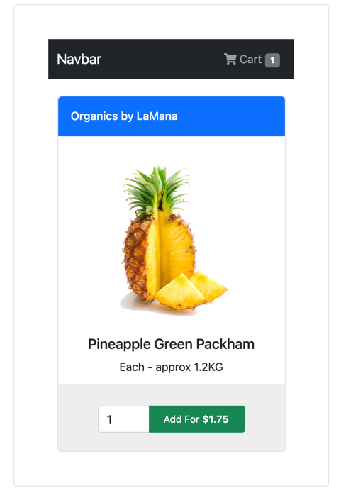

HTMX works on the philosophy of **[Locality of Behavior](https://htmx.org/essays/locality-of-behaviour/)**. Adopting this philosophy means we will define HTMX definitions and the result of the behavior as close to each other as possible. The more relative everything is, the more decipherable our application is to developers needing to maintain and adapt our codebase.

In general, it is easy to adhere to this philosophy, but there's always an exception to a rule. For example, an everyday use case where we break this rule is when dealing with an application shell. A shopping site is a good example, where a global shopping item indicator displays the number of items contained within the cart. Adding an item to our cart will increment the display with the latest total item count; removing an item will reduce the count. So how can we implement this user experience using HTMX?



Since application shells are typically unique elements on the page, we can add identifiers to specific HTML elements using the `id` attribute. So, we have a cart button with an `id` of `cartNavbar` in our example.

```html
<a id="cartNavbar" class="nav-link ms-10" aria-current="page" href="#">
    <i class="fa fa-shopping-cart"></i>
    Cart
    <span class="badge bg-secondary">@Model.TotalItemsInCart</span>
</a>
```

HTMX can process responses before placing them into our target element. Therefore, we only need to add the `hx-swap-oob` attribute along with a value of `true` along with any additional HTML we need HTMX to swap into the DOM.

```html
    <a id="cartNavbar" hx-swap-oob="true" class="nav-link ms-10" aria-current="page" href="#">
        <i class="fa fa-shopping-cart"></i>
        Cart
        <span class="badge bg-secondary">4</span>
    </a>
<div id="shoppingItem" class="d-flex justify-content-center align-items-center container px-2 mt-4">
    <div class="card">
        <div class="top d-flex flex-row align-items-center bg-primary">
            <h6 class="mb-0 mr-2">Organics by LaMana</h6> <i class="fa fa-opencart"></i>
        </div>
        <div class="middle">
            
            <h5>Pineapple Green Packham</h5> <span>Each - approx 1.2KG</span>
        </div>
        <div class="bottom d-flex flex-row justify-content-center">
            <form hx-swap="outerHTML" hx-target="#shoppingItem" hx-post="/examples/13-out-of-band-swaps?handler=AddToCart">
                <div class="input-group mb-3">
                    <input id="count" type="number" min="0" max="100" class="form-control" name="count" value="4">
                    <button type="submit" class="btn btn-success btn-sm add">
                        Add For <b>$1.75</b>
                    </button>
                </div>
            </form>
        </div>
    </div>
</div>
```

You may be asking, "Why is out-of-band swapping a dark art?" Adding multiple HTML elements to a single request can become an overwhelming architectural task on the server. In addition, extra HTML elements may need further resources from database calls, third-party services, or other dependencies. So, in general, use this technique sparingly, as it can get out of control quickly. For ASP.NET Core users, we can take advantage of MVC Filters, View Components, and TagHelpers to isolate application shell elements without adding to the complexity of our endpoints. Be aware, as a word of general advice, hiding complexity does not remove its cost. Just because you can't see it, it doesn't mean it is not there.

Other techniques to avoid out-of-band swaps might be to use the `HX-Trigger` HTTP header on responses, which will force all elements subscribed to that event to refresh themselves.

```c#
Response.Htmx(h =>
{
    h.Trigger("updateCart")
});
```

Using the `HX-Trigger` header, we are potentially sacrificing performance for architectural simplicity. Consider each option as you design and build your application and when you have complex application shell elements.

We'll take many of these HTMX concepts in the following video and put them into a real-world shopping cart sample.