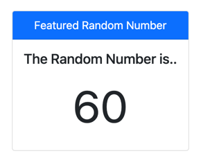

In the previous sample, we saw that we could poll our server for updated information. While an acceptable approach, it's still a client calling the server without knowing any updated information is available. What if we only want to contact the server when there is new data to retrieve?

Well, that's where **[Server-sent Events (SSE)](https://developer.mozilla.org/en-US/docs/Web/API/Server-sent_events/Using_server-sent_events)** come in. With SSE, a client establishes a connection to the server. The server knows which clients are connected and can issue events through the link.

For this sample, we'll be using the NuGet package [`Lib.AspNetCore.ServerSentEvents`](https://www.nuget.org/packages/Lib.AspNetCore.ServerSentEvents/). Unlike the other examples in this series, we'll have to do a bit more work around infrastructure. The first step is to register Server-sent Events as a feature in our ASP.NET Core application. In an ASP.NET Core 6 application, we can register our services in the `Program.cs` file.

```c#
// dependencies for server sent events
builder.Services.AddServerSentEvents();
builder.Services.AddHostedService<ServerEventsWorker>();
```

We need to create a hosted service that will be the endpoint that our client will connect to for streamed information.

```c#
public class ServerEventsWorker: IHostedService
{
    private readonly IServerSentEventsService client;

    public ServerEventsWorker(IServerSentEventsService client)
    {
        this.client = client;
    }

    public async Task StartAsync(CancellationToken cancellationToken)
    {
        try
        {
            while (!cancellationToken.IsCancellationRequested)
            {
                var clients = client.GetClients();
                if (clients.Any())
                {
                    Number.Value = RandomNumberGenerator.GetInt32(1, 100);
                    await client.SendEventAsync(
                        new ServerSentEvent
                        {
                            Id = "number",
                            Type = "number",
                            Data = new List<string>
                            {
                                Number.Value.ToString()
                            }
                        },
                        cancellationToken
                    );
                }

                await Task.Delay(TimeSpan.FromSeconds(1), cancellationToken);
            }
        }
        catch (TaskCanceledException)
        {
        }
    }

    public Task StopAsync(CancellationToken cancellationToken)
    {
        return Task.CompletedTask;
    }
}
```

We'll be calling all clients at a one-second interval to let them know we've generated a brand new random number. At which point, they can retrieve the latest information. Remember how I said clients first need a connection to the server? Well, let's give clients an endpoint that connects them to the server. Back in our `Program.cs`, we'll need to map the following endpoint.

```c#
// the connection for server events
app.MapServerSentEvents("/rn-updates");
```

While SSE can pass information to the client, HTMX works by making HTTP Requests. So, even though our server sends an event with the latest random number, our client is still required to make a call to retrieve an HTML snippet.

```html
<div class="d-flex justify-content-center">
    <div hx-sse="connect:/rn-updates" class="card mb-3 text-center" style="max-width: 18rem;">
        <div class="card-header bg-primary text-white">Featured Random Number</div>
        <div class="card-body">
            <h5 class="card-title">The Random Number is..</h5>
            <p class="card-text fa-4x"
               hx-trigger="sse:number"
               hx-get="@Url.Page("11_ServerEvents", "Random")">
                <span>@Number.Value</span>
            </p>
        </div>
    </div>
</div>
```

Running the sample, you should see the numbers update on a one-second interval. Try opening multiple browser windows, and you'll see that numbers all update simultaneously, as opposed to long polling, where the client sets the retrieval interval.



SSE architecture can be a helpful tool when building web applications but comes with the caveat of having clients connected to a server during the duration of a session. Managed connections require additional resources in memory and CPU, which may require scaling your backend services. Therefore, when considering SSE, you should estimate the number of clients connected at one time and whether you could accomplish the same results with long polling.

In the following video, we'll look at the .NET companion packages to make working with HTMX more convenient in Razor pages and server-side code.