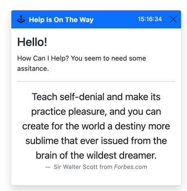

Over the internet's evolution, web applications have seen a transformation from read-only pages to now providing experiences that rival native desktop applications. One of the significant attributes that power users look for in their applications is keyboard shortcuts. Keyboard shortcuts can reduce the time it takes to perform an action and increase the productivity of repetitive tasks. As developers, we likely have a few keyboard shortcuts that come to mind, and ReSharper and Rider users are likely familiar with the `Alt+Enter` keyboard shortcut. Keyboard shortcuts are awesome.

As we've seen in previous samples, HTMX doesn't restrict [triggers](https://htmx.org/attributes/hx-trigger/) to the events you might expect. Quite the contrary, you can listen for a lot of different events, including a [combination of keystrokes](https://htmx.org/attributes/hx-trigger/). So, in the following example, we'll listen to know when the user presses the `?` key and display a toast notification in the bottom-right of our screen.



The first step is to configure our HTMX attributes on our Razor Page.

```html
<div class="mb-5" 
     hx-get="@Url.Page("08_Shortcuts", "Help")"
     hx-target="#toast-goes-here"
     hx-trigger="keyup[key=='?'] from:body"
     hx-swap="innerHtml">
```

Notice that our `hx-trigger` attribute has a value of `keyup[key=='?'] from:body`. HTMX will trigger the `hx-get` request if the `?` keystroke is invoked anywhere within our HTML body. Since DOM events bubble up, we'll see our toast notification injected into our target element of `#toast-goes-here`. In the trigger, we're also using a concept known as a **trigger filter**, which uses brackets (`[]`) and allows HTMX developers to laser-focus events on specific key combinations.

Our server-side implementation is nothing note-worthy, but let's look at it for completeness.

```c#
public async Task<IActionResult> OnGetHelp([FromServices] HttpClient http)
{
    var json = await http.GetStringAsync(ApiUrl);
    var result = JsonNode.Parse(json);

    return Partial("_Toast", new Quote(
            result?["thought"]?["thoughtAuthor"]?["name"]?.ToString() ?? "",
            result?["thought"]?["quote"]?.ToString() ?? ""
        )
    );
}
```

We've implemented this toast notification as a separate endpoint which calls an API and renders a partial. The toast partial is a standard Razor view.

```html
@model Exercises.Pages.Shortcuts.Quote
@{ ArgumentNullException.ThrowIfNull(Model); }

<div id="toast" class="toast show" role="alert" aria-live="assertive" aria-atomic="true">
    <div class="toast-header bg-primary text-white">
        
        <strong class="me-auto">Help Is On The Way</strong>
        <small>@DateTime.Now.ToLongTimeString()</small>
        <button type="button"
                class="btn-close"
                _="on click remove #toast"
                aria-label="Close">
        </button>
    </div>
    <div class="toast-body">
        <h4 class="card-title"> Hello! </h4>
        <p>How Can I Help? You seem to need some assitance.</p>
        <hr/>
        <figure class="text-center">
            <blockquote class="blockquote">
                <p>@Model.Text</p>
            </blockquote>
            <figcaption class="blockquote-footer">
                @Model.Author from <cite title="Forbes.com">Forbes.com</cite>
            </figcaption>
        </figure>
    </div>
</div>
```

While this sample scenario is simple, You can write HTMX triggers to fit some very complex designs, with the ability to trigger around visibility, mouse movements, key combos, timers, and custom events. In general, if you can imagine it, HTMX can trigger requests off of it.

The following video will see a possible option for performing complex server-side form validation with a client-side feel.