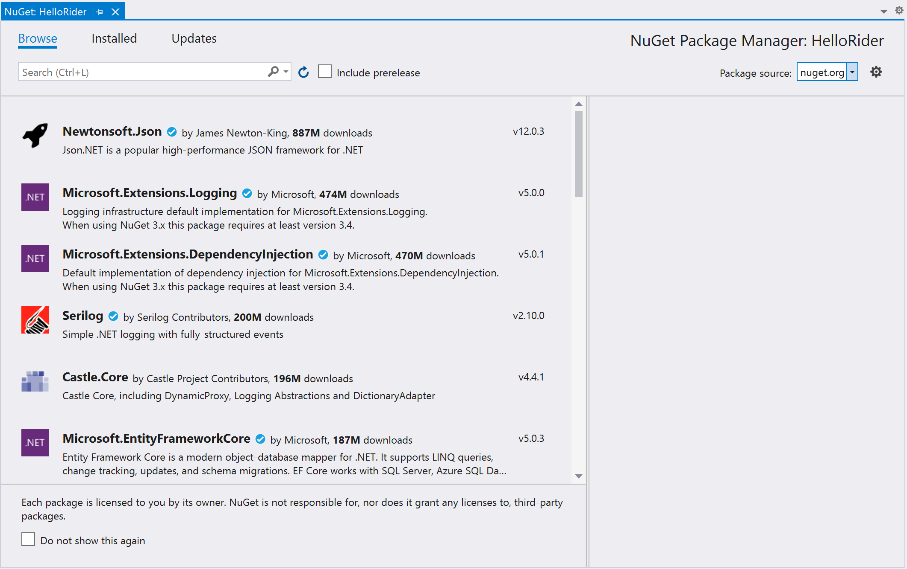
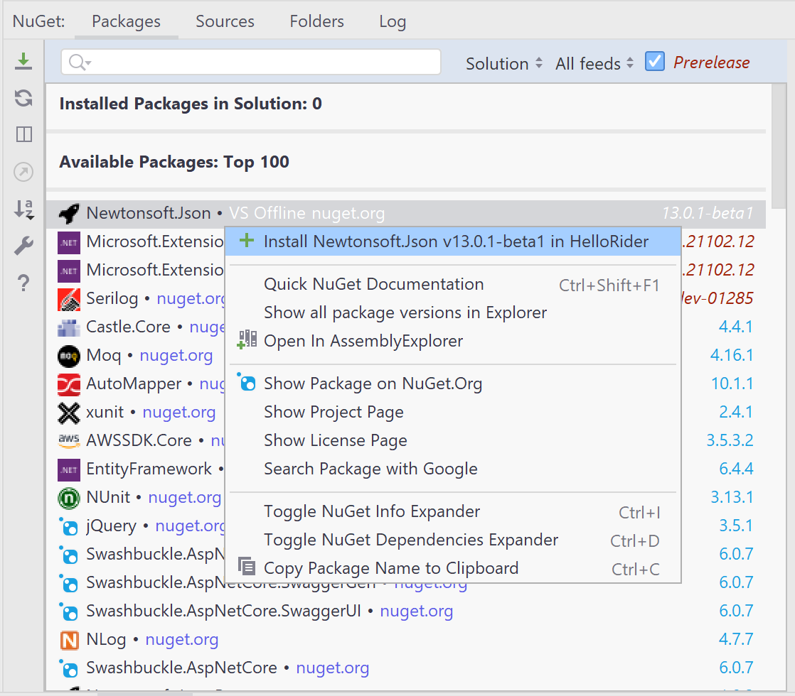
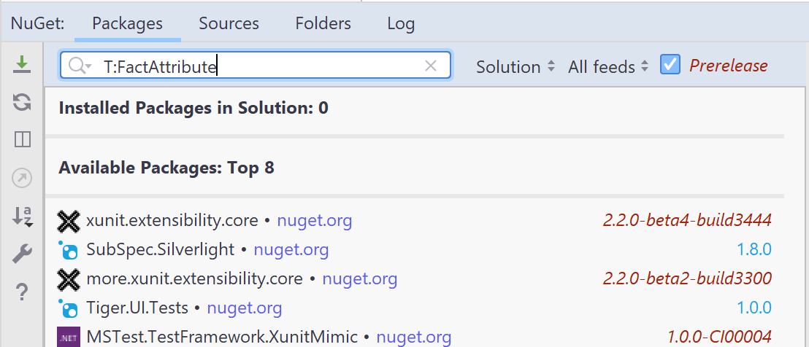

We can find the greatest strength of every modern development stack in its community. More precisely, in its open-source offerings. For .NET Developers, we can access the breadth of community know-how through NuGet. Visual Studio users will likely be familiar with the NuGet tool window, where developers can manage existing dependencies or add new ones.

In Visual Studio's NuGet tool window, we can see the package's name, its authors, current version, license, and additional metadata to help the user understand more about the dependency. We can also manage the sources Visual Studio will use to search and download the packages.

When we install a package, the NuGet process will update the appropriate project (`.csproj`) targets with our selected package's information.

Rider offers several approaches to help developers manage dependencies. Let's start with the most common method, using the **NuGet Tool Window**. We will find the **NuGet Tool Window** tab at the bottom of our IDE instance. Clicking the tab will show a UI that includes a search bar, results, installed packages, and additional metadata.

We can add a package to the entire solution or selectively choose the projects that require a specific package from the tool window. If we're still unsure about a particular package, we can use the <kbd>Alt+Enter</kbd> shortcut to toggle a context menu that will display several actions used to help us learn more about a package:

- Quick NuGet Documentation
- Open In Assembly Explorer
- Show Package on NuGet.Org
- Show Project Package
- Show License Page
- Search Package with Google

Our personal favorite is to use the **Open In Assembly Explorer** action, downloading the package and loading it in Rider's world-class **Assembly Explorer**. We can explore the contents of any package and be sure it matches our expectations.

For folks who like working within the `.csproj` file format, the NuGet tools built into Rider also work within the editor. When we add a new `PackageReference` to the existing item group, we'll see search results appear in the `Include` attribute. The `Version` will also list version numbers once we set the `Include` attribute.

While NuGet may be the primary source for packages for many of us, it is likely not the only source. Many development teams develop and share internal packages across teams; after all, sharing is caring. Rider's NuGet tool window will read local `nuget.config` files, along with allowing us to specify recurring feeds in the **Sources** tab. Within this tab, we can see when and where the NuGet tool will attempt to find a NuGet package and resolve it.

As we've seen, the Rider NuGet Tool Window is more than capable of managing existing NuGet dependencies and finding new OSS packages to help solve any problem. But there is still one more thing that differentiates Rider's NuGet tool from the one found in Visual Studio. That feature is **Type search**.  Using the `T:` prefix in our NuGet search bar will find all packages that contain a Type definition.

This feature is also available in the editor. We can recall types from memory and then use a quick action to **Find the type on NuGet.org...*, allowing us to stay in the flow and continue writing code.

When working with NuGet packages, Rider gives developers options, regardless of your workflow. Whether we want to perform some exhaustive research or know precisely what package we need, Rider is there to help.

### See Also

- [NuGet Tool Window in Rider](/tutorials/rider-essentials/nuget/)
- [Using NuGet in Rider](https://www.jetbrains.com/help/rider/Using_NuGet.html)
- [NuGet Tool Window Reference](https://www.jetbrains.com/help/rider/Reference_Windows_NuGet.html)
