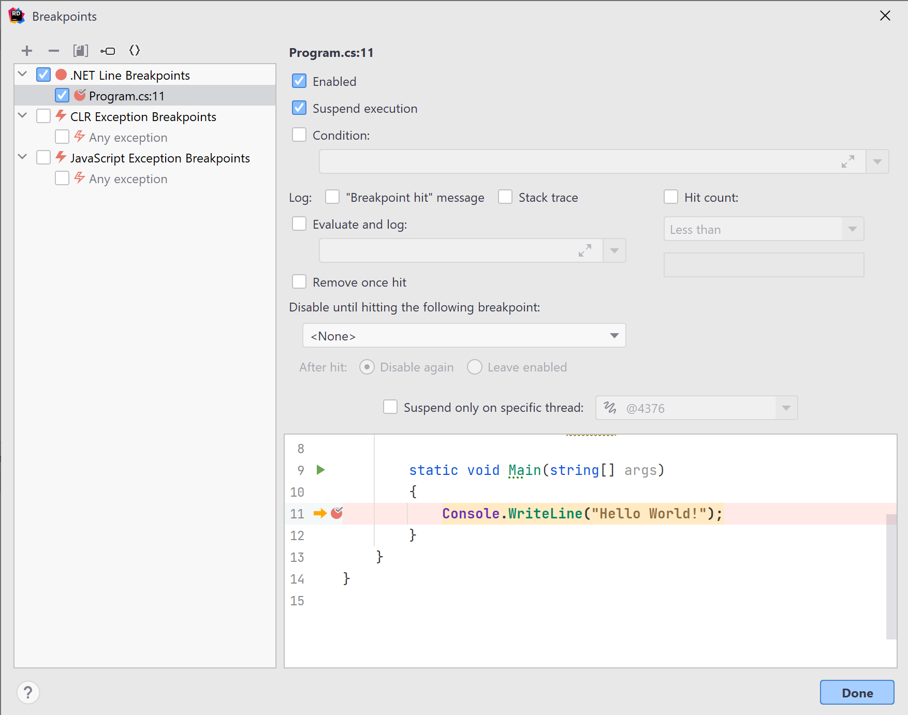

As developers, we try our hardest to avoid introducing bugs and exceptions into our codebase. Unfortunately, regardless of the care we take, mistakes are inevitable. The debugging experience is a stand-out feature of the .NET platform, and it gets even better with JetBrains Rider. Many of the same features ReSharper users have learned to enjoy are there in the Rider experience, along with some additional UI upgrades that we know our users love.

## Main Toolbar and Run Button

One of the first changes developers will notice from Visual Studio is the **Run** button in the main toolbar, shown as a _play_ icon. In Visual Studio, the **Run** button will immediately initiate a debugging session. We may be used to running our applications with the debugger attached, but there are side-effects to getting in the habit of always running in debug mode:

- Our applications will operate slower due to debugging overhead.
- We are running unoptimized code, never experiencing production code until further down the development lifecycle.
- Utilize more resources during development than is necessary.

In Rider, users will see a clear functional difference, as the **Run** button will only start the current run configuration. To attach the debugger, we can either click the **Debug** icon, use the **Debug** shortcut, or attach the debugger to an existing process.

When you initiate a debugging session, the **run widget** will change in appearance with a clear yellow highlight and the word **Debugging** next to the run configuration name. You'll also notice the visible buttons have changed to provide quicker access to debugging actions **restart**, **resume**, and **stop**.

The **run widget** is a recent addition to Rider and should help you more easily transition from Visual Studio. While the run widget is the most prominent debugging interface in Rider, as you continue to read, you'll see we've exposed several ways to interact with a debugging session.

## Debugging Shortcuts

Many of the same debugging shortcuts are available in Rider, depending on the keymap developers chose during the JetBrains Rider's initial setup.

- <kbd>F5</kbd>: Start a new debugging session or resume the current session.
- <kbd>F9</kbd>: Set a breakpoint on the current line.
- <kbd>F10</kbd>: Step over current line.
- <kbd>F11</kbd>: Step into current line.

[There are more shortcuts around debugging, which you can read about in our official documentation](https://www.jetbrains.com/help/rider/Debugging_Code.html).

## Debugger Window

Unlike Visual Studio, Rider has a dedicated window for all things debugging. This tool window is only visible when in an active debugging session, and it will display **threads**, **frames**, **locals**, **autos**, **watches**, **debug output**, **the immediate window**, and **memory registers**. This UI ensures that we stay focused on solving issues during debugging sessions rather than hunting down tool windows and rearranging them.

In addition to relevant information about our application, we can also access the debugging toolbar on the window's top-most border. Here we can **restart**, **stop**, **resume**, and **pause** the current debugging session. We can also **step-over**, **step-into**, and **step-out** of our code. Finally we have some additional elements to quickly manage breakpoints.

### Managing Breakpoints

Most developers will be happy managing breakpoints in the editor using the `F9` shortcut or by clicking the space in the gutter. As the complexity of our apps increases, managing breakpoints can help increase our productivity. Below the action buttons in the debugger window, developers will find the **View Breakpoints and Exceptions** button. Here we can see all existing breakpoints, add or modify and conditions, and enable and disable CLR exceptions.

### Locals, Auto, and Watches

Within the Visual Studio UI, **autos**, **locals**, and **watches** are different windows. Within Rider, we can find all variables within the debugger tool window. In addition to seeing the values of variables within the debugger tool window, we can see current values right in the editor with what we call **debugging adornments**.

[Check out our guide on debugging tips and tricks to learn more about debugging adornments along with other features.](https://jetbrains.com/dotnet/guide/tutorials/rider-essentials/debugging/)

### Immediate Window

The immediate window is an essential experimentation tool for debugging sessions. It allows developers to evaluate expressions within the scope of the currently executing application.  Developers can execute code that declares a new variable, retrieves the value of an existing variable, or mutate any current state. The immediate window has all the same code completion features developers are used to within Rider's editor.

[Read more about the **immediate window** at our official .NET blog.](https://blog.jetbrains.com/dotnet/2020/10/15/immediate-window-interact-with-your-code-while-debugging-in-rider/)

## Conclusion

As mentioned previously, debugging will likely be the most considerable difference for folks moving from Visual Studio + ReSharper to Rider.  The Rider team has invested care and attention in fine-tuning the debugging experience for developers. Taking a few minutes to understand where debugging elements are can help save hundreds of hours during an application development lifecycle.

### See Also

- [Debugging in Rider](https://www.jetbrains.com/help/rider/Debugging_Code.html)
- [Run Configurations](https://www.jetbrains.com/help/rider/Run_Debug_Configuration.html)
- [Run/Debug Configurations in Rider](https://blog.jetbrains.com/dotnet/2017/08/23/rundebug-configurations-rider/)
- [Debugging third-party/external code](https://blog.jetbrains.com/dotnet/2017/12/20/debugging-third-party-code-rider/)
