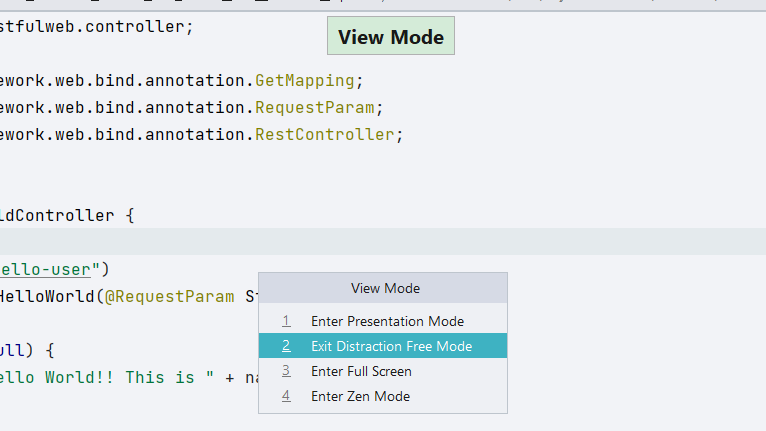
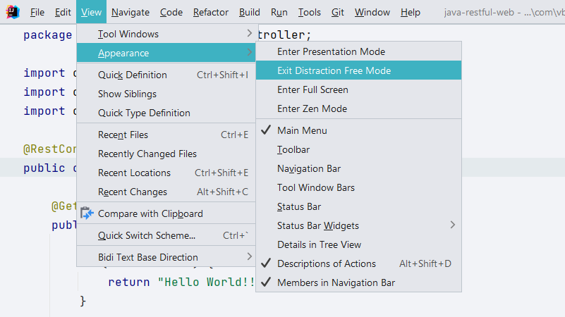
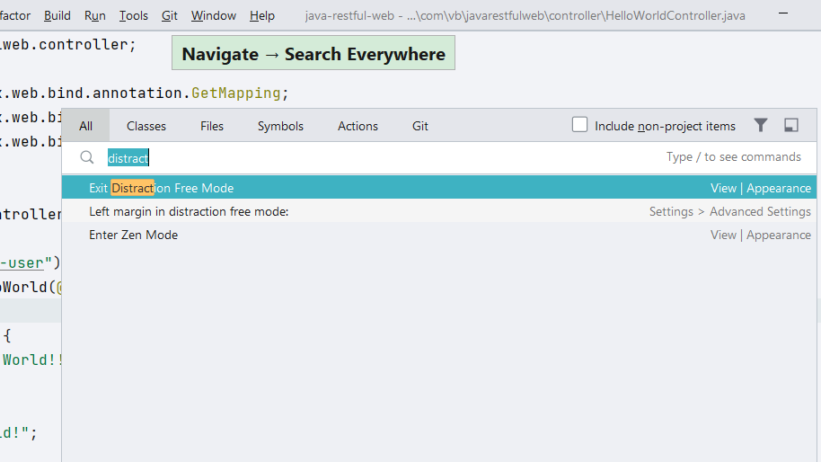

## Enter Distraction Free Mode 

### Using View Toolbar Options
Alternately, you can **Enter Distraction Free Mode** by using options available in **View -> Appearance** menu. 

### Using Search Everywhere
Use **⇧⇧** (macOS), or **Shift+Shift** (Windows/Linux), to bring up the Search Everywhere dialog. You can now search for _Distraction_ and select **Enter Distraction Free Mode**.

## Exit Distraction Free Mode

You can follow anyone of the above-mentioned ways to toggle _Distraction Free Mode_

### Using Quick Switch Schema

### Using View Toolbar Options

### Using Search Everywhere

