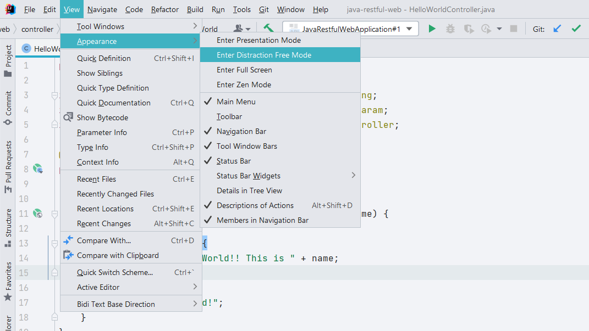
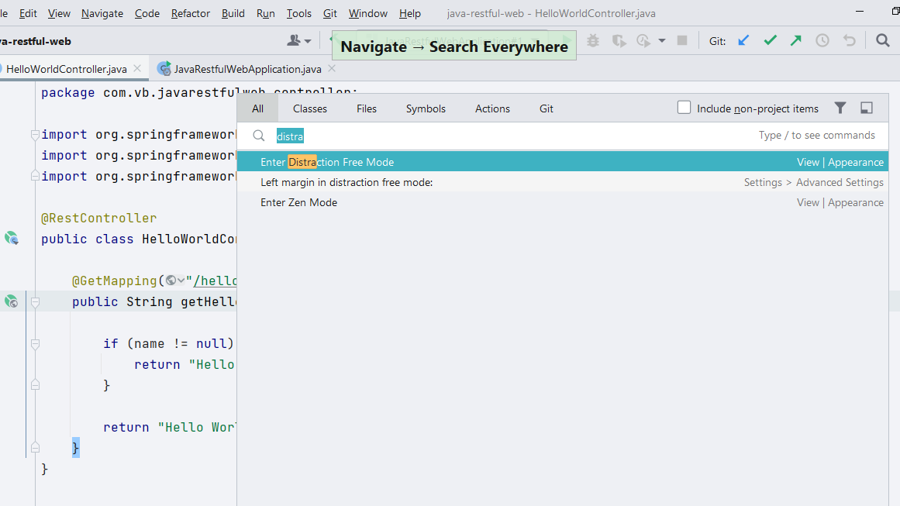
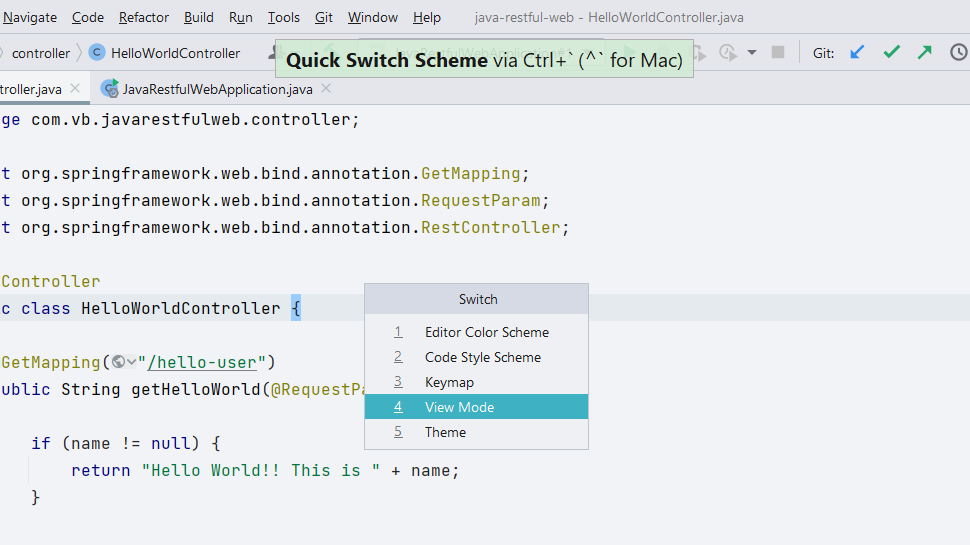

## Enter Distraction Free Mode Using View Toolbar Options
Alternately, you can **Enter Distraction Free Mode** by using options available in **View -> Appearance** menu. 

## Enter Distraction Free Mode using Search Everywhere
Use **⇧⇧** (macOS), or **Shift+Shift** (Windows/Linux), to bring up the Search Everywhere dialog. You can now search for _Distraction_ and select **Enter Distraction Free Mode**.

## Navigate using Numbers in Quick Switch Scheme dialog
When you open **Quick Switch Scheme** dialog, use number key **4** to see list of view modes available and use number key **2** to **Enter Distraction Free Mode**

