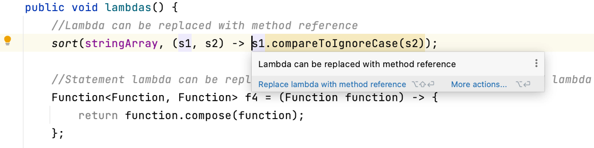

  While you're coding, you may want to jump to the next error or warning (**F2**) or the last one (**Shift+F2**). This way, you can quickly hop to the next thing that needs fixing or addressing without having to move your hand to the mouse.

  Combine this with **⌥⏎** (macOS), or **Alt+Enter** (Windows/Linux) to quickly see the suggested solution to the problem and apply a fix. This will show a list of suggested solutions, as we saw in the [tip about Alt+Enter](../alt-enter), and we can pick the solution that suits us best.

  If you're confident IntelliJ IDEA has the correct fix for the problem, you can skip the step of listing the solutions. Press **F2** to navigate to the problem, then press **⌥⇧⏎** (macOS), or **Shift+Alt+Enter** (Windows/Linux), to accept IntelliJ IDEA's suggested fix. 

---
