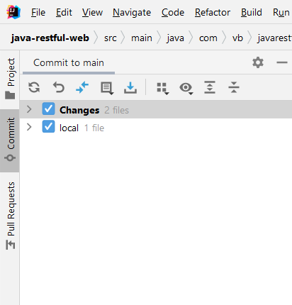
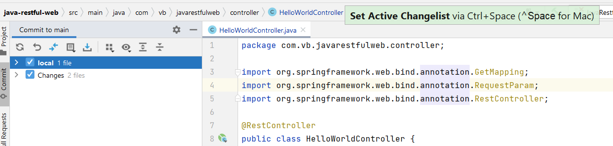
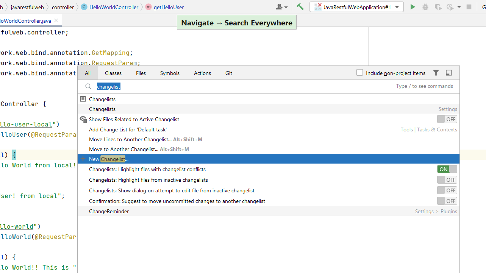
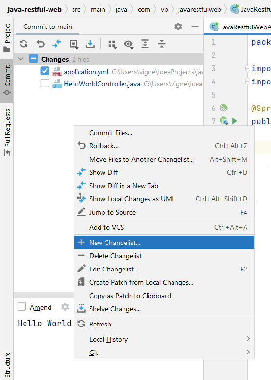
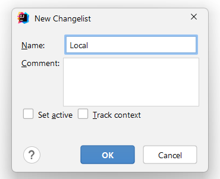
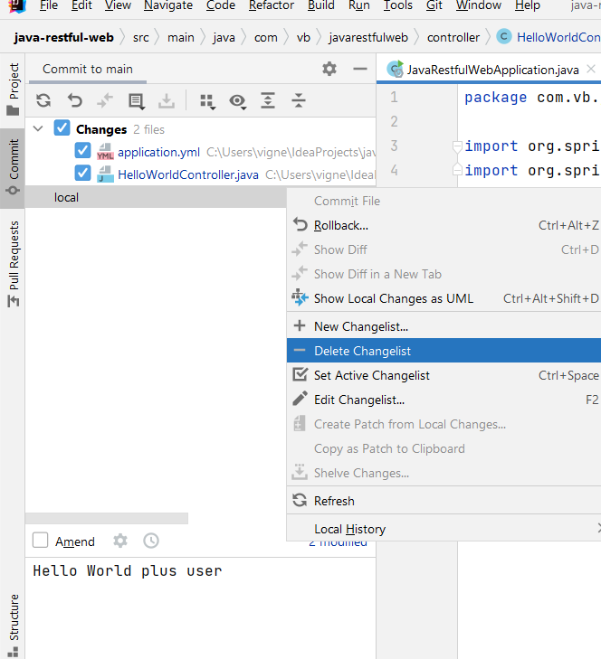

## Default Active Changelist

Use **⌘0** (macOS) or **Alt + 0** (Windows/Linux), to show the **Commit** tool window.

**Changes** in **Commit Tool Window** is default active changelist. Active changelist is highlighted in bold.

### Set Active Changelist
You can set changelist to Active if you want to commit your changes to VCS. Select the changelist, use **^Space** (macOS) or **Ctrl + Space** (Windows/Linux) to set as active changelist.

## Creating Changelist

### Using Search Everywhere
Use **⇧⇧** (macOS), or **Shift+Shift** (Windows/Linux), to bring up the Search Everywhere dialog. You can now search for _Changelist_ and select **New changelist...** to bring up **New changelist** dialog.

### Using Commit Window
You can also right-click or secondary click on Commit Window to show options and click **New changelist...** to bring up **New changelist** dialog.

### New changelist dialog

[New Changelist dialog Reference](https://www.jetbrains.com/help/idea/2021.2/new-changelist-dialog.html)

## Deleting Changelist

You can use Commit Window to **Delete Changelist**

Alternatively, you can use **⌘⇧A** (macOS), or **Ctrl+Shift+A** (Windows/Linux), to bring up the Find Actions dialog which will filter the Search Everywhere dialog to just Actions.

# Scenarios to use different changelists
  - Suppose you are working on your code which requires only selected changes to be committed in VCS and still you want to continue developing your code. In that case, you can move your changes to different changelist and group together.
  - If you want to run your application with unique configuration without impacting your existing code, you can maintain the changed files in different changelist