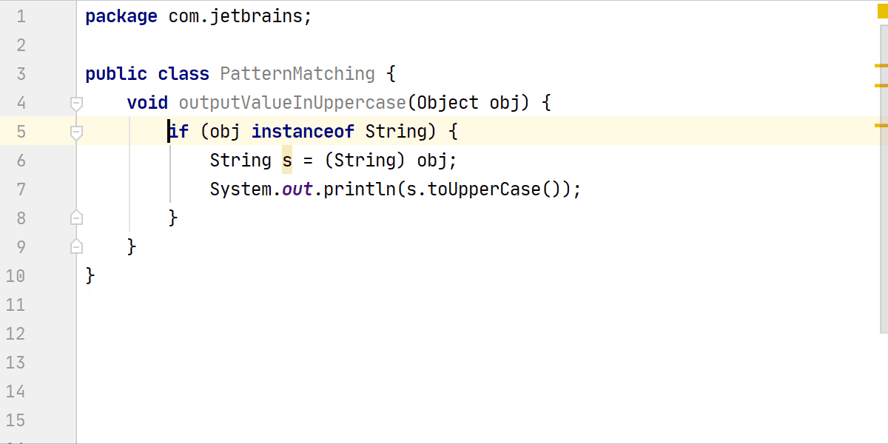
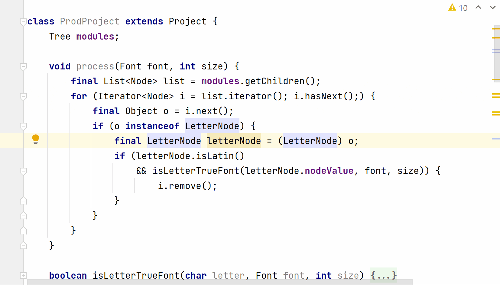

# Pattern Matching for `instanceof`
This feature extends the `instanceof` operator with the possibility to use a type pattern. It checks whether an instance is of a certain type. If the test passes, it casts and assigns the value to a pattern variable. This removes the need to define an additional variable or to perform explicit casting in order to to use members of the instance being compared.

```java
void outputValueInUppercase(Object obj) {
   if (obj instanceof String) {              
       String s = (String) obj;             
       System.out.println(s.toUpperCase()); 
   }
}
```

In IntelliJ IDEA, you can invoke context-sensitive actions on the variable s (by using Alt+Enter or by clicking the light bulb icon) and selecting Replace ‘s’ with a pattern variable to use pattern matching for instanceof:



The scope of the pattern variable (a local variable) is limited to the `if`-block because it makes no sense to be able to access the pattern variable if the test fails.

The simplicity of pattern matching of instanceof might be deceptive. If you are thinking it doesn’t matter much since it only removes one line of code, think again. Removal of just one line of code can open up a number of possibilities in which you can modify your code. For example, aside from using pattern matching for instanceof, the following code merges if statements, introduces a pattern variable, and replaces a for loop with `Collection.removeIf()`:



Now, let me brief you on the enhancements to the switch statement with the switch expressions (covered in detail [here](https://blog.jetbrains.com/idea/2019/02/java-12-and-intellij-idea), with Java 12, and [here](https://blog.jetbrains.com/idea/2019/11/java-13-and-intellij-idea/) with changes in Java 13). As I mentioned before, if you are already familiar with switch expressions, please feel free to jump to the section ‘Welcome to pattern matching for switch’.

## Switch expressions – what benefits do they bring to the table?
Switch expressions enhance the switch statement and improve the coding experience for developers. As compared to the switch statements, switch expressions can *return a value*. The ability to define *multiple* constants with a *switch* branch, and the improved code semantics, makes it *concise*. By removing default fall-through in the switch branches, you are less likely to introduce a *logical* error in a switch expression.

Let’s look at an example that demonstrates the advantages switch expressions can have over switch statements.

In the following code, the switch statement has repetitive break and assignment statements in case labels, which adds noise to the code. The default fall-through in switch branches can sneak in a logical error. For example, if we delete the break statement for case label `STRAW`, it results in an assignment of 300 instead of 200 to the variable damage when you call the method  `getDamageToPlanet()`, passing it the value `SingleUsePlastic.STRAW`. Also, with switch statements there isn’t any way to exhaustively iterate over the finite enum values:

```java
public class Planet {

    enum SingleUsePlastic {
        CUP, STRAW, BOTTLE
    }

    int getDamageToPlanet(SingleUsePlastic plastic) {
        int damage = -1;
        switch (plastic) {
            case CUP:
                damage = 100;
                break;
            case STRAW:
                damage = 200;
                break;
            case BOTTLE:
                damage = 300;
                break;
        }
        return damage;
    }
}
```

Let’s see how switch expressions can help. The following gif demonstrates some of the benefits of switch expressions such as concise code, improved code semantics, no redundant break statements, exhaustive iteration, and more:


With a basic understanding of pattern matching, pattern matching for instanceof, and switch expressions, let’s look at what pattern matching is and why you need it?