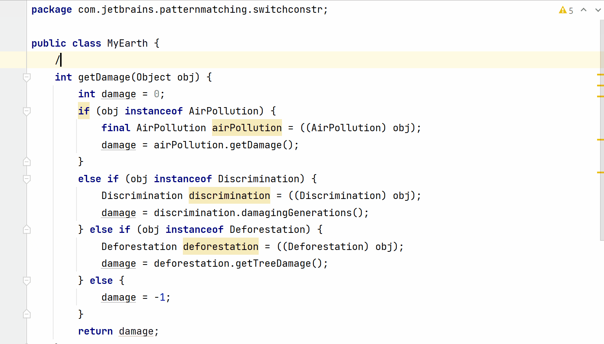
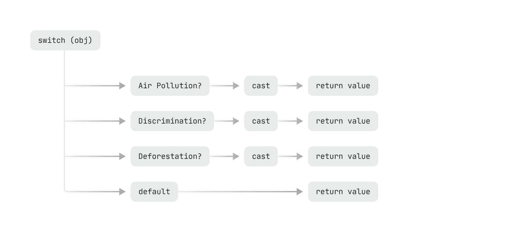
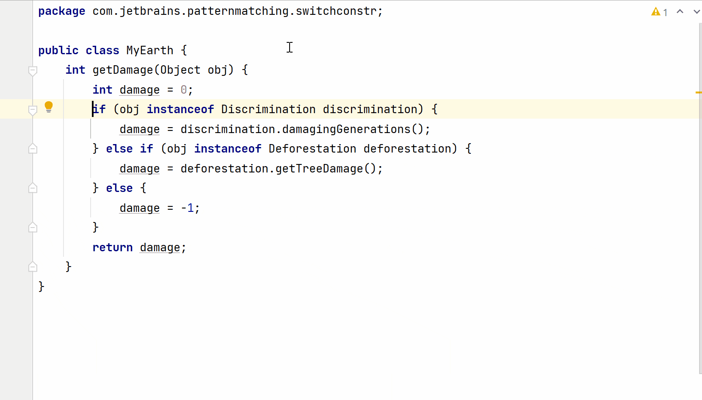

# Pattern Matching For Switch

Example: Replace if-else statement chains with concise switch constructs – that test types beyond int integrals, String, or enums.

You can work with switch constructs that can be passed a wide range of selector expressions, and can test values not just against constants but also types. That’s not all, case labels can also include complex conditions.

Let’s work with a set of unrelated classes – `AirPollution`, `Discrimination`, and `Deforestation`. These classes represent things that harm our planet. To quantify the harm, each of these classes define methods that return an int value, like, `getAQI()`, `damagingGenerations()`, and `getTreeDamage()`. The classes define minimal code to keep it simple:

```java
class AirPollution {
  public int getAQI() {
    return 100;
  }
}

public class Discrimination {
  public int damagingGenerations() {
    return 2000;
  }
}
public class Deforestation {
  public int getTreeDamage() {
    return 300;
  }
}
```

Imagine a class `MyEarth`, with a method, say, `getDamage()` that accepts a method parameter of type `Object`. Depending on the type of the object passed to this method, it calls the relevant method on the method parameter to get a quantifiable number for the amount of harm it is causing to our planet:

```java
public class MyEarth {
   int getDamage(Object obj) {
       int damage = 0;
       if (obj instanceof AirPollution) {
           final AirPollution airPollution = ((AirPollution) obj);
           damage = airPollution.getDamage();
       }
       else if (obj instanceof Discrimination) {
           Discrimination discrimination = ((Discrimination) obj);
           damage = discrimination.damagingGenerations();
       } else if (obj instanceof Deforestation) {
           Deforestation deforestation = ((Deforestation) obj);
           damage = deforestation.getTreeDamage();
       } else {
           damage = -1;
       }
       return damage;
   }
}
```

Let’s look at how we can use switch expressions and IntelliJ IDEA to make this code more concise:



Here’s the final (concise) code for reference:

```java
public class MyEarth {
    int getDamage(Object obj) {
        return switch (obj) {
            case final AirPollution airPollution -> airPollution.getDamage();
            case Discrimination discrimination -> discrimination.damagingGenerations();
            case Deforestation deforestation -> deforestation.getTreeDamage();
            case null, default -> -1;
        };
    }
}
```

The power of this construct lies in how often it helps to reduce the cognitive complexity in the code, as I discuss in the following section.

## Reducing cognitive complexity with pattern matching for switch
An if-else statement chain *seems* complex to read and understand – each condition should be *carefully* read together with its then-and-else code blocks. If we consider the if statement chain from the preceding section, it can be represented roughly as follows:


Now let me represent the switch construct from the preceding section:



Even by looking at both these images, the switch logic (though similar) looks simpler to read and understand. An if statement chain *seems* to represent a *long, complex* path, in which the next turn *seems* to be unknown. But this isn’t the case with the switch construct.

Let’s look at other reasons for working with pattern matching for switch.

## Yay! You can now handle nulls within a switch construct

Previously, switch constructs never allowed using null as a case label, even though it accepted instances of class `String` and enumerations. Then how was it possible to test whether the reference variable you are switching over is not null? 

One approach has been to add a `@NotNull` annotation to the variable accepted by the switch construct. You can add this annotation to a method argument, a local variable, field, or static variable. Another approach (much widely used) has been to check if the variable is not null by using an if condition. 

Of course, if you do not explicitly check for null values and the selector expression is `null`, it throws a `NullPointerExpression`. For backward compatibility, the null selector expression won’t match the default label.

Now, you can define null as one of the valid case labels – so that you can define what to do if the selector expression is null.



## Does IntelliJ IDEA convert your if-statement to a switch expression or a switch statement?
In the preceding example, the if-else construct was converted to a switch expression. However, if you’d have selected this conversion, *before* using pattern matching for instanceof, you would have got a switch statement, as shown in the following gif: 