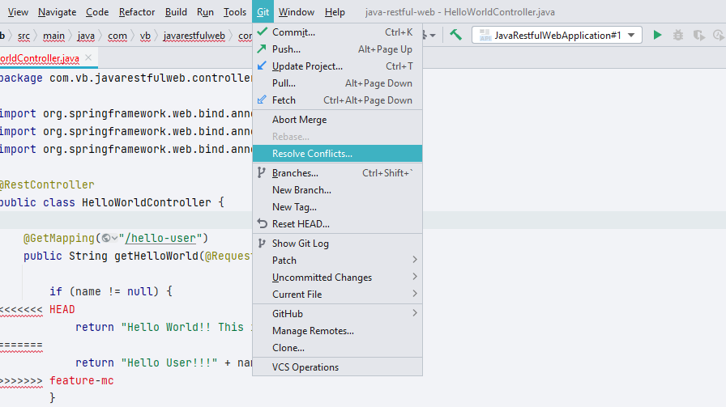
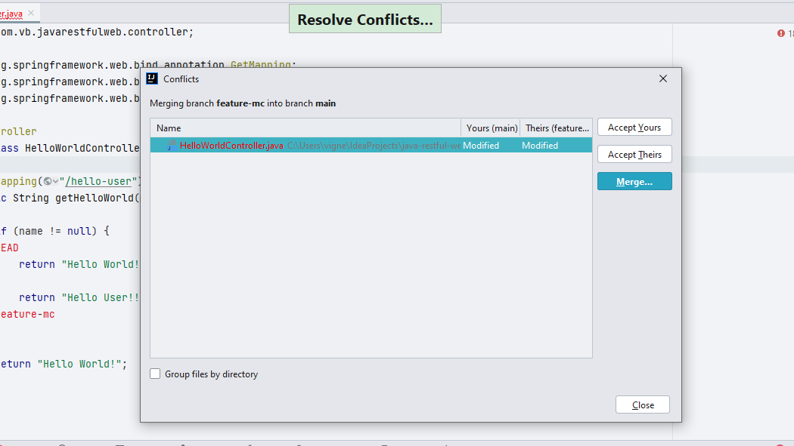
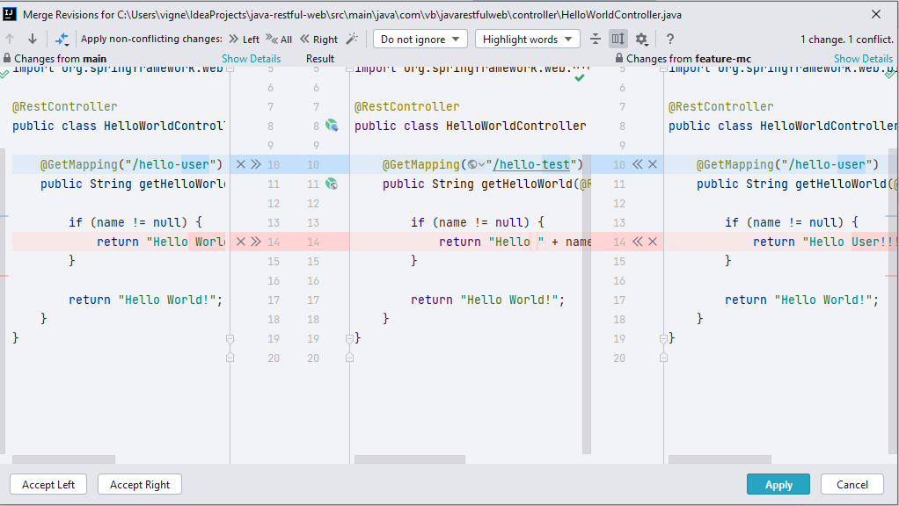
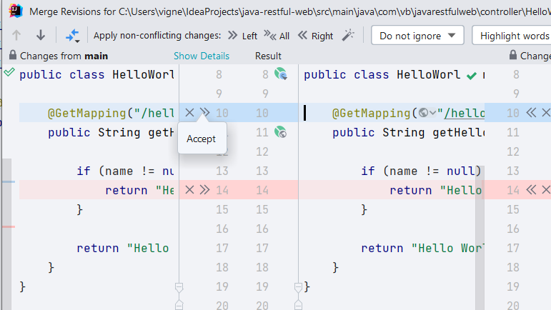
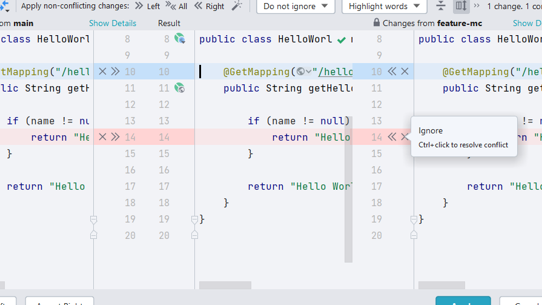
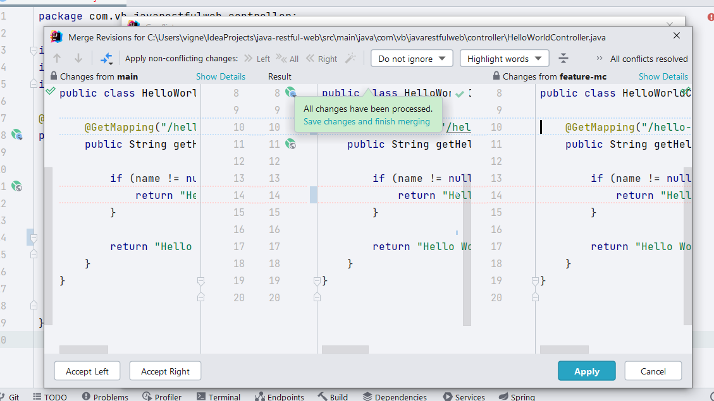

## Resolving Conflicts Using Git Toolbar Options
Alternately, you can open the **Conflicts** dialog by using **Git -> Resolve Conflicts** option available from the menu. 

### Conflicts Dialog
The **Conflicts** dialog shows a list of files that have merge conflicts. You can select files and merge manually, or you can accept either your changes or their (incoming) changes. 

### Manually Resolving Conflicts using Merge
When you manually merge changes, you use the **Merge Revisions** dialog which provides a visual view of changes and conflicts between two different versions of the code. It has three different views:

#### Left View
The Left view shows your changes of the file. 

#### Result View
The Result view is where any changes made and conflicts resolved are shown visually. You can always refer to the Result View to keep making required changes and resolving conflicts.

#### Right View
The Right view shows the incoming file changes.

### Resolving Merge Conflicts
You should carefully review the changes **_(highlighted in blue)_** and accept any one of the changes that are required. In case of conflicts **_(highlighted in red)_**, you should accept the changes that you want, and ignore those that you don't.

#### Accepting Code Changes

To accept a code change, click on the **>>** symbol in the Left View or the **<<** symbol in the Right View which is pointing towards the Result view. This will apply the corresponding change in the Result view.

#### Ignoring Code Changes

To ignore a code change, click on the **X**. This means that the change is disregarded from the selected view (Left or Right). Ignoring code changes means that they are not applied to the Result view.

### Finish Merging

When you have successfully resolved all your merge conflicts, IntelliJ IDEA will prompt you that **All Changes have been processed**. When you press **Apply** the conflicts in the file are all resolved.