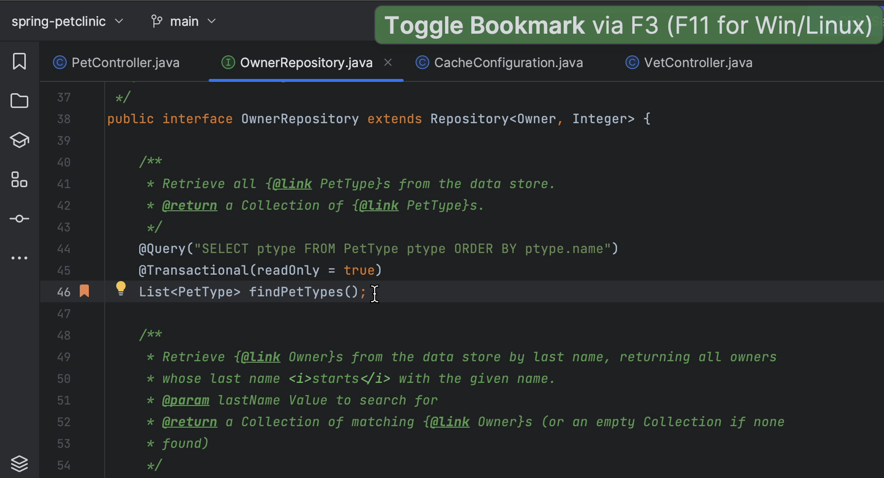
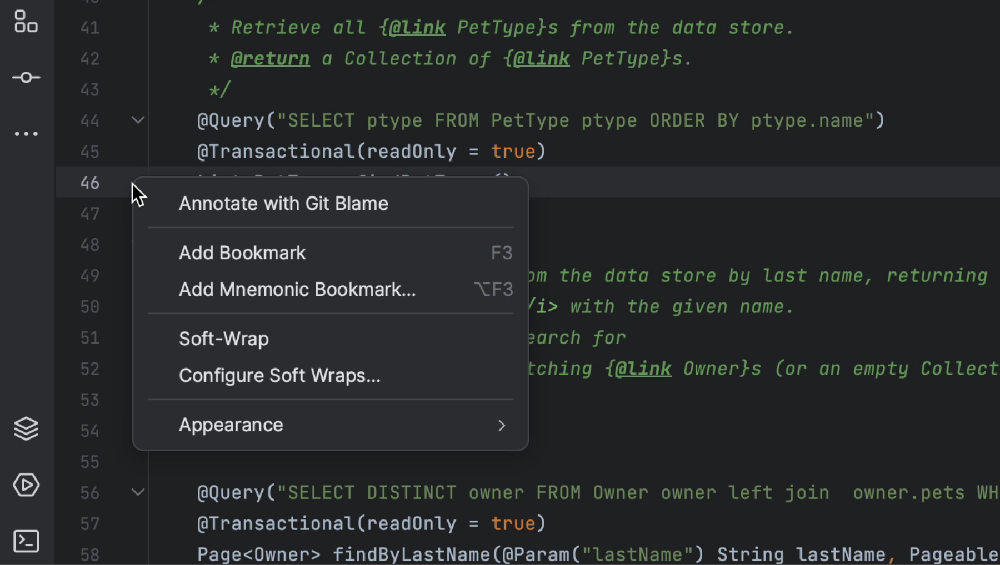
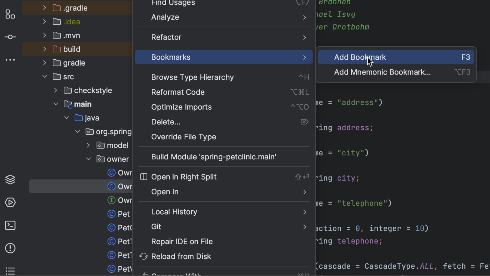

We can bookmark a line by pressing **F3** (on macOS) or **F11** (on Windows/Linux). This shortcut creates an anonymous line bookmark, marked with a Bookmark icon. If we don't remember the shortcut, we can right-click the gutter next to the line of code we want to bookmark and select **Add Bookmark**.

We can also bookmark files, packages, folders, and modules. We can open the Project Tool Window (**⌘1** on macOS, or **Alt+1** on Windows/Linux) and add an anonymous bookmark. We can use the shortcut (**F3** on macOS, or **F11** on Windows/Linux) or, we can also right-click the item we want to bookmark, and select **Bookmarks | Add Bookmark**. Note that anonymous bookmarks don't have an identifier, and we can create as many anonymous bookmarks as we like.

