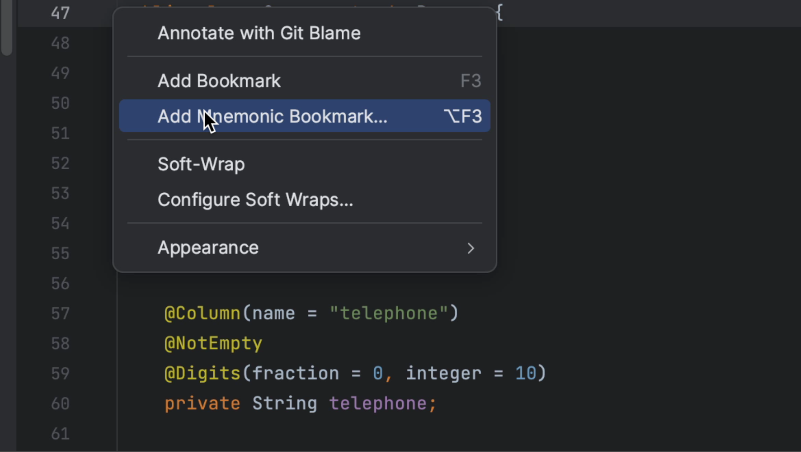
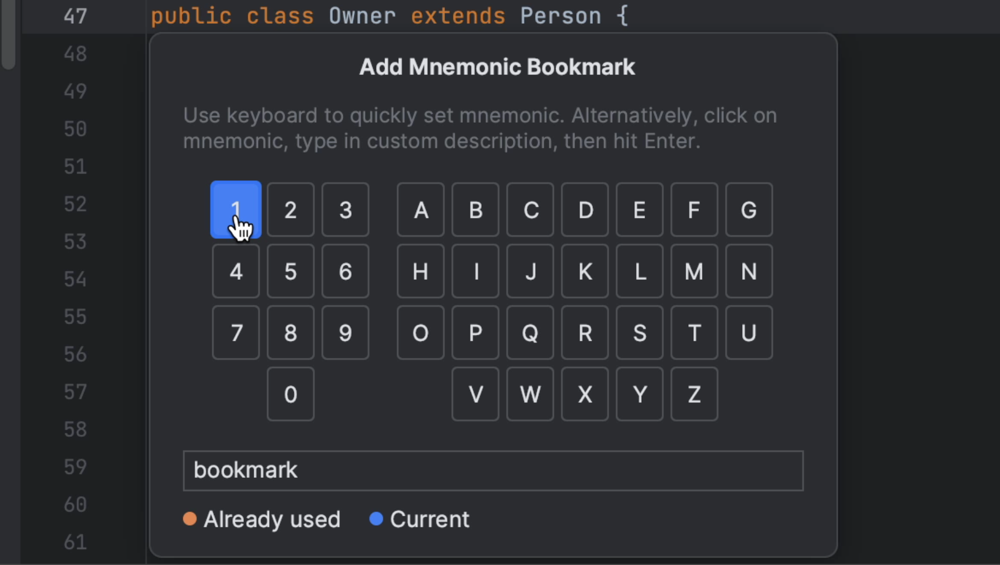
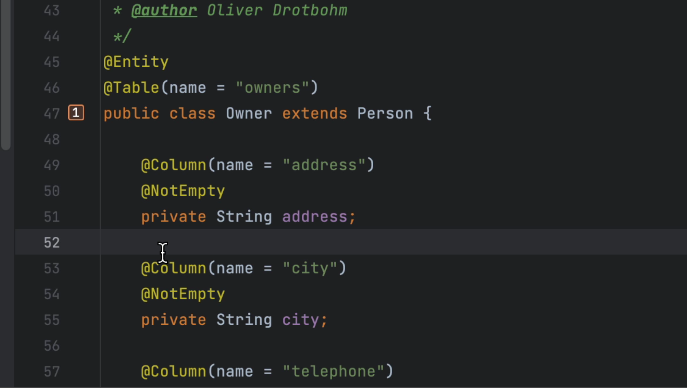
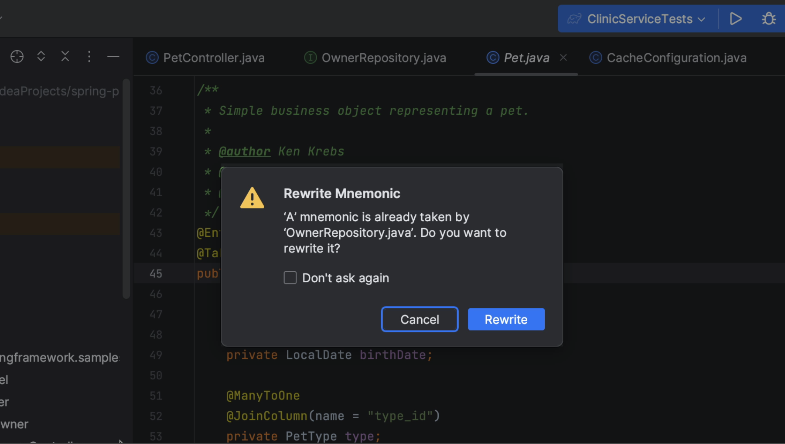

We can also create bookmarks that are assigned to a digit (0 to 9) or letter (A to Z). To add a mnemonic line bookmark, press **⌥ F3** (on macOS) or **Control+F11** (on Windows/Linux) and press the digit or letter to use as an identifier for this bookmark. Again, we can also or right-click the gutter next to the line of code that you want to bookmark and select **Add Mnemonic Bookmark**.

Optionally, we can provide a description for the new bookmark. We can double-click the digit or letter we want to assign. 

Lines marked with mnemonic bookmarks have the corresponding digit or letter icon in a frame.

If the selected digit or letter is already in use, IntelliJ IDEA will ask you whether you want to overwrite an existing bookmark with the new one. When we select the **Don't ask again** option, the IDE will silently overwrite mnemonics.

