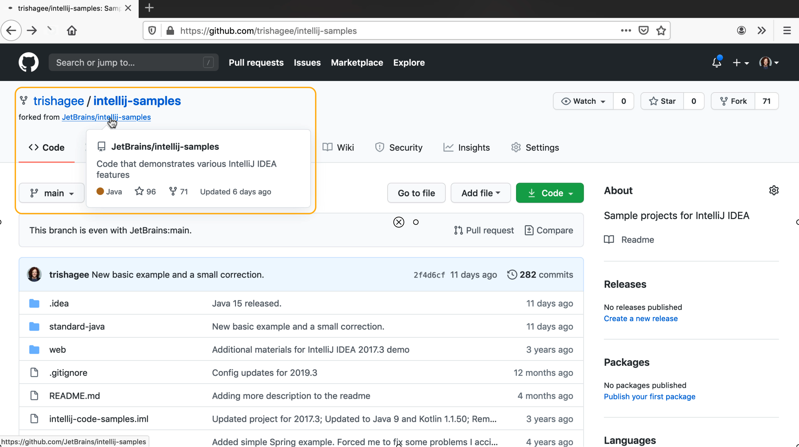
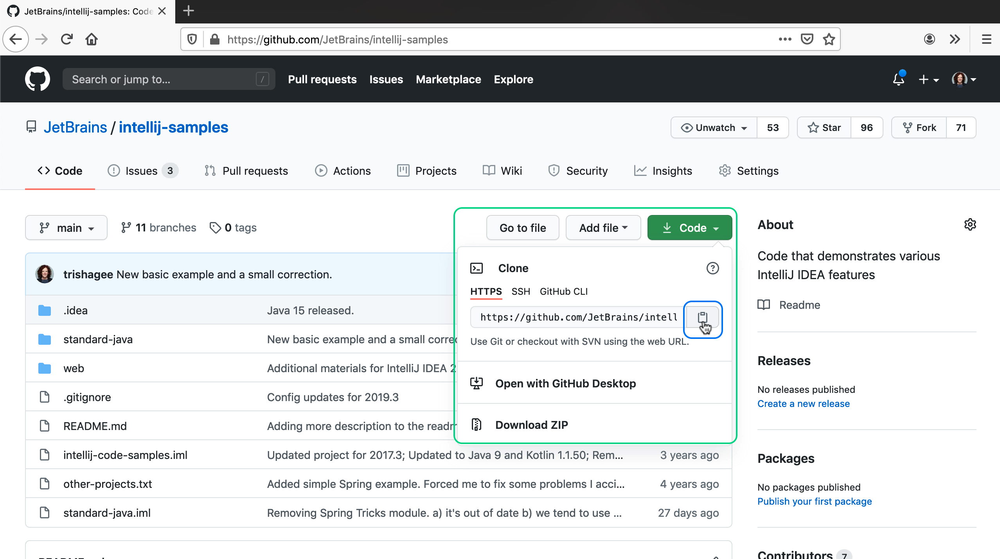
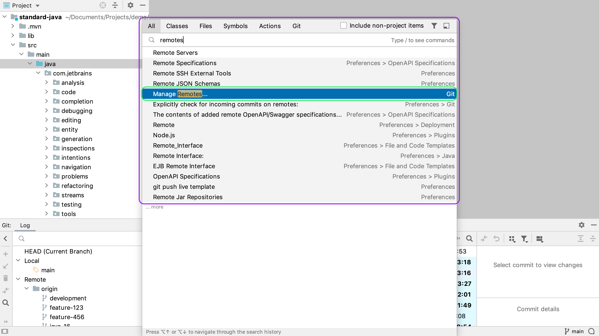
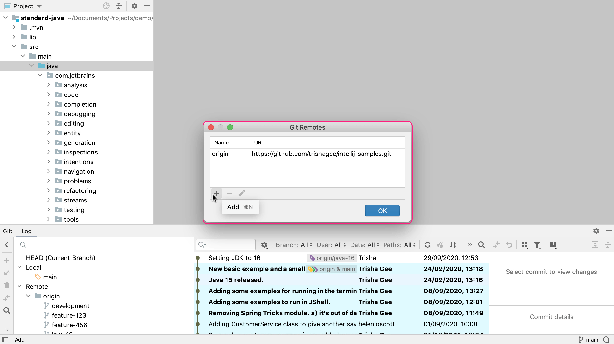
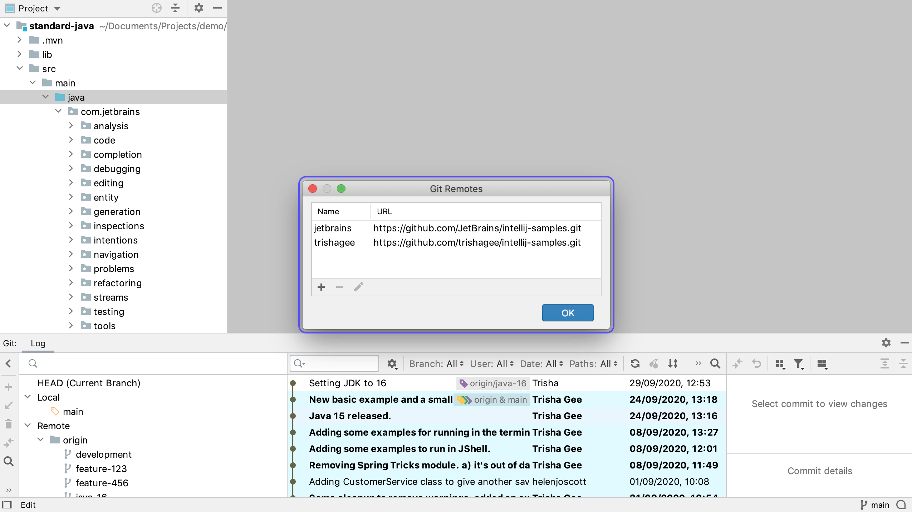

When you're working with open source projects on GitHub, it's common to have more than one remote associated with a repository. If you go back to the intellij-samples project that we cloned from GitHub, we can see that this is actually a fork of another repository. 

This upstream repository is in the JetBrains organisation, and is likely to be updated by multiple people at a different rate to my fork. Ideally you want visibility of the upstream repository as well as your own fork, in order to get a better idea of what changes have gone in, and to update our own fork with these changes.

To do that, copy the URL of the _upstream_ repo with in the same way we did before with the **Code** button and then copy the HTTP link to your clipboard. 

Now, let's use Search Everywhere, by pressing **Shift** twice. In the Search Everywhere dialog, type _Remotes_, one of the search results is the _Manage Remotes_ option from _Git_. Press **Enter** on this option to display the **Git Remotes** dialog. 

Here we can see the remote that we originally cloned this project from, this is our fork of the _intellij-samples_ repository. We want to add a new repository for the upstream repo, that is, the original JetBrains repo.

Lets add this repository by pressing the **+** button. You can now give it a name and paste in the path to the JetBrains repository that's on your clipboard. There are a number of different conventions that you could use to decide on the name for your remote, for example you could call it "upstream". We recommend that you use the organisation or profile name to remove any ambiguity. You can also use this dialog to make changes to your existing remotes if you want to. For example, you can rename the "origin" remote to your name if it's your specific branch like in this case. 

When you have pressed **OK** on your new remote, the Git Remotes dialog will show both your remotes/

Like most features in IntelliJ IDEA, there's more than one way to open the Manage Remotes dialog. You can also right-click on the _Remote_ node in the branches tree of the Git Log tool window, and select **Manage Remotes**.