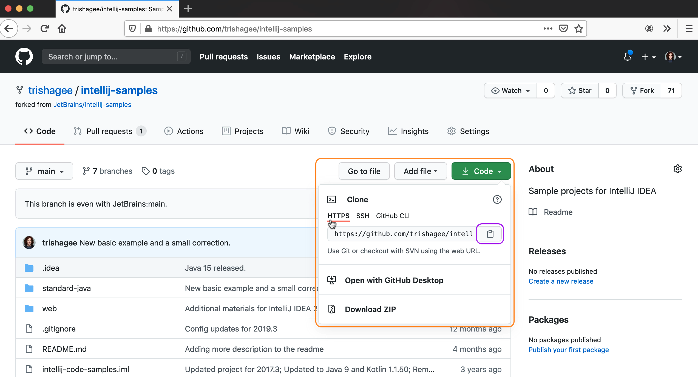

The first thing we need to do is to clone the repository to our local machine. You need to navigate to the code in GitHub that you want to clone to IntelliJ IDEA. In this tutorial we will use the [_intellij-samples_ project](https://github.com/JetBrains/intellij-samples). 

When you press the green **Code** button, you can see that there are a few ways to do this. We're going to use HTTPS as it can be the simplest option. From the HTTPS tab, click the clipboard icon, this copies the URL to your clipboard.

Now you've got the link from GitHub, you need to open IntelliJ IDEA. If you don't have any projects option, you'll see the Welcome Screen. You will see an option here to **Get from Version Control** (or similar depending on the version of IntelliJ IDEA).  If you do have a project open already, you can do the same action from the **File > New > Project from Version Control** menu. In older versions of IntelliJ IDEA, you can also use go to **VCS > Get from Version Control**. This menu option was renamed to **Git > Clone** in newer versions (when you have an existing Git project open). 

When you press this button, you will get an option to select your Version Control location, GitHub in this instance, and then to enter the URL that's on your clipboard into the URL field.

Press **Enter** or **Clone** to clone the GitHub repository to the directory you selected. IntelliJ IDEA will also pick up common build tools like Gradle or Maven, and automatically download the required dependencies and build the project.

When you open up the project window, you'll also see that IntelliJ IDEA has detected the modules in the project, and correctly set up the _test_, _main_ and _resources_ folders in a Maven project like this one.

### Related YouTube Links
- [Cloning a Project from GitHub](https://www.youtube.com/watch?v=aBVOAnygcZw)