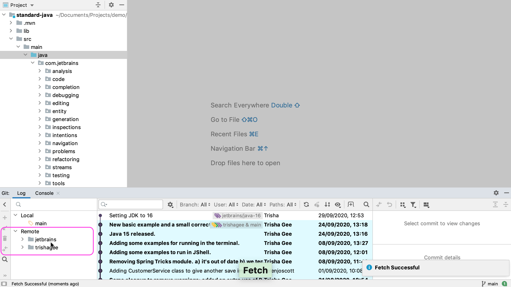
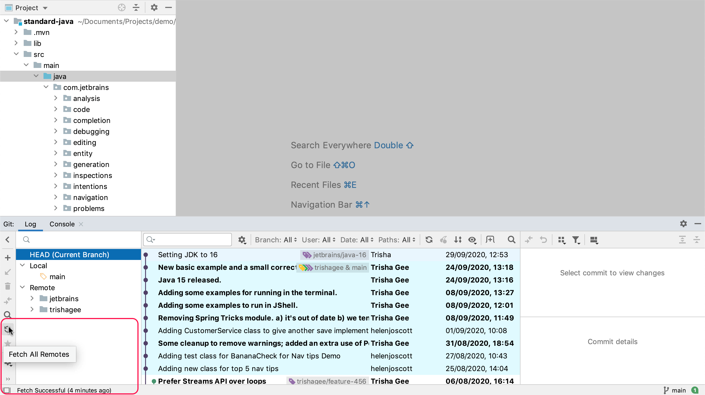

You just added a new remote to this project, but it's not showing in the Git Log tool window. This also means that none of its branches or commits are visible either. This is because we haven't fetched the status of the new remote to our local project. We can call Fetch by using the menu **Git > Fetch**. When you do this, IntelliJ IDEA will go and get all the relevant details from _all_ the Git Remotes we have for the project, and the Git log will be updated with these details. Now you can see a new remote in the log window, and we can see all this remote's branches. We will also be able to see the remote's branches in the commit list. This gives you a clear idea of which commits are on which branches, and if any branches need updating.

Another way of performing a Git fetch is to click on the **Fetch All Remotes** button on the Branches tree toolbar in the Git Log window. This will also update the project.

