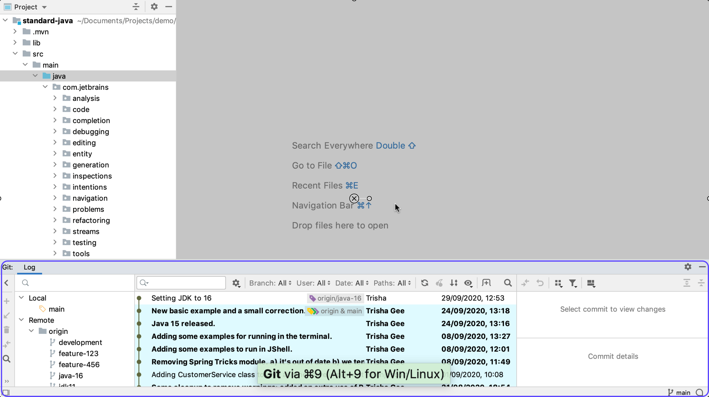

One of the most useful tools when you're working with a Git project is the Git Tool Window. This gives you visibility over the version control status of your project. One way to open the Git tool window is to hover over the quick access button in the bottom left of the IntelliJ IDEA window, and select **Git**. This will open the Git Log tool window. Alternatively, you can use **⌘9** (macOS), or **Alt+9** (Windows/Linux), to open the Git Log tool window.

This window shows you all the commits for the project. You can also see a list of local branches, which in this case is just the "main" branch since we just cloned this repository. You can also see the remote branches too. If you find a visual representation of the commit history useful, this window can help you to understand the status of commits, branches, and remotes for your project.
