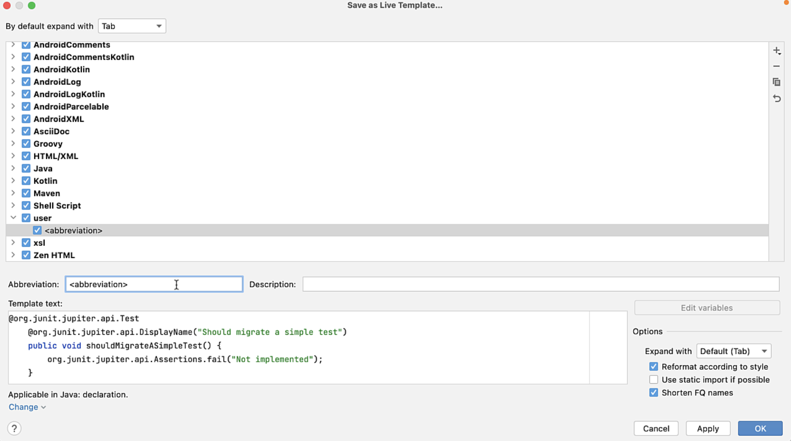
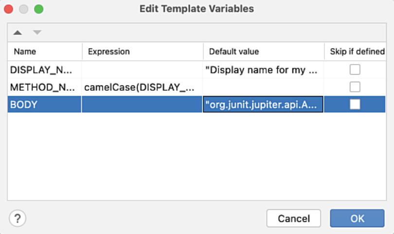
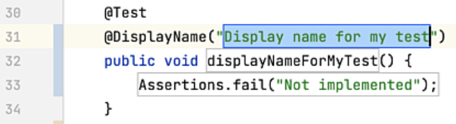
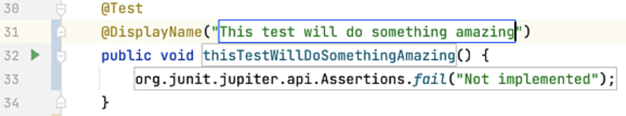

In this example, we're going to create a Live Template to insert the code construct for a new JUnit test. We're going to base this Live Template on existing code:

```java
@Test
@DisplayName("Should migrate a simple test")
public void shouldMigrateASimpleTest() {
    Assertions.fail("Not implemented");
}
```

1. You can find this code in the [JUnit4to5 class in GitHub](https://github.com/JetBrains/intellij-samples/blob/main/java-samples/src/test/com/jetbrains/testing/JUnit4To5.java) to follow along. Alternatively, you can copy this code snippet and paste it into the Template Text of the Live Template as we did for the basic example.
2. With the code snippet selected, go to the **Code > Save as Live Template**. IntelliJ IDEA will load your Settings/Preferences and paste the selected code into the Template Text:



3. One again, enter an abbreviation to trigger this Live Template, for example `junit`.
4. Give your Live Template a suitable description such as `Creates a new JUnit test that fails`.
5. Next you need to modify the template text to use variables rather than hard coded values. In addition, cut the method body to your clipboard. You can cut the whole line with **⌘X** (macOS), **Ctrl+X** (Windows/Linux) without highlighting it providing your caret is anywhere on the line.

```java
@Test
@DisplayName("$DISPLAY_NAME$")
public void $METHOD_NAME$() {
    $BODY$
}
```

You can choose the name of your variables, but remember to keep the quotes for the Display Name and copy the method body to your clipboard.

4. Press **Edit variables**. Give your $DISPLAY_NAME$ variable a default value such as `Display name for my test`. 
5. For your $METHOD_NAME$ variable, use the [Expression](https://www.jetbrains.com/help/idea/template-variables.html) drop-down and select `camelCase(String)`.
6. Pass your $DISPLAY_NAME$ String into your `camelCase` expression so that it reads `camelCase(DISPLAY_NAME)` - you do not need the quotes around your variable here. We will see how this works in a few steps.
7. Lastly, in quotes, paste the body of your method that you placed on your clipboard earlier. Remove any errant preceding spaces and escape the quote marks correctly. Your final string should read `"Assertions.fail(\"Not implemented\")";`.



8. Press **OK**. Your context should not need changing as IntelliJ IDEA will correctly detect the context if you highlighted the code and then created the Live Template using the **Code** menu. If you typed the code snippet in manually, you'll need to select **Java: declaration** as we did in the simple example in the previous step.
9. Press **OK** to return to the JUnit4to5 class and type in `junit` to create a new test using the Live Template we created:



10. Enter a name for your new test such as `This test will do something amazing.` The camelCase expression that we used when we created the Live Template will update the method name with the same string, but in camelCase:



Now we can now go ahead and implement our test as required. Congratulations you've created your own Live Template from some existing code and saved yourself some typing!

---