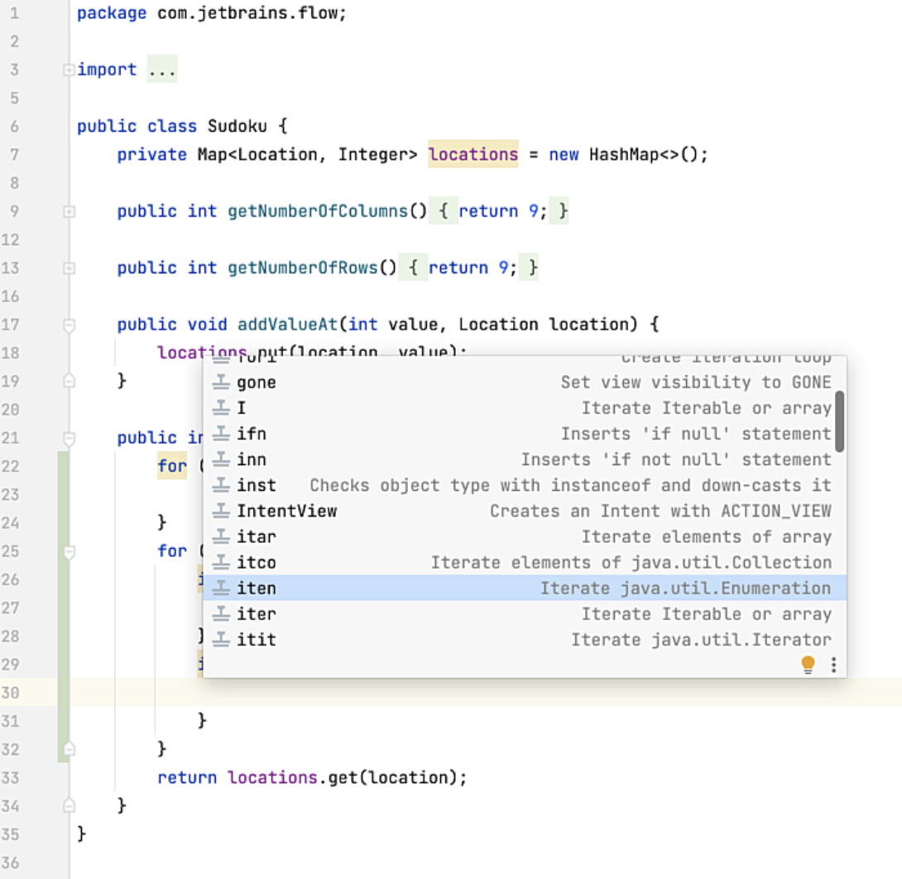

You can type less code with [Live Templates](https://www.jetbrains.com/help/idea/using-live-templates.html) because they allow you to use abbreviations to create common code constructs, so you can save your fingers. 

IntelliJ IDEA comes with several Live Templates, but you can also create your own which we will do in this tutorial. You can invoke Live Templates with **⌘J** (macOS), or **Ctrl+J** (Windows and Linux):

You can scroll through the available live templates and press **⏎** (macOS), **Enter** (Windows/Linux) to select them. However, what if you want to create your own? You can view existing live templates and create your own in your Settings and Preferences with **⌘,** (macOS), or **Ctrl+Alt+S** (Windows/Linux).

---