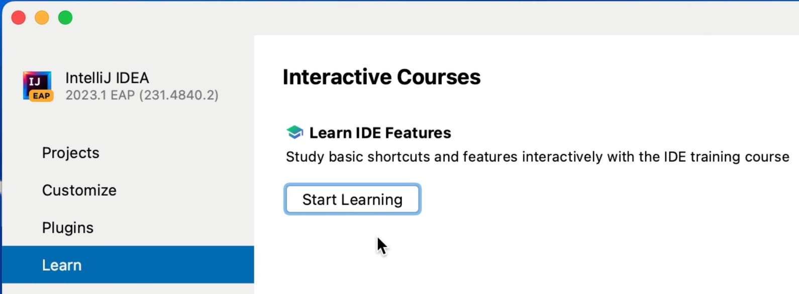
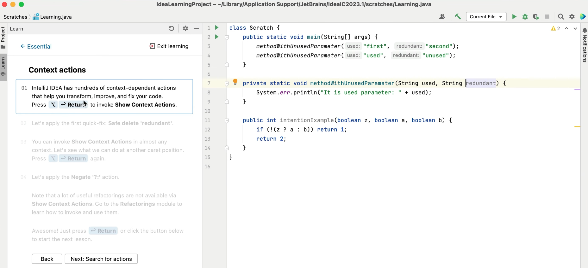

The Feature Trainer is bundled with IntelliJ IDEA and is a powerful tool that users who are new to the IDE can work through to help them go faster, quicker.

## Feature Trainer

<iframe width="560" height="315" src="https://www.youtube.com/embed/UfN8iWKHvt0" >
</iframe>

You can access the Feature Trainer from the Learn Tab on the Welcome Screen or from the **Help > Learn IDE Features** in an existing project.

The IDE Feature Trainer assumes no prior knowledge or context so it's a great way to learn the IDE and step through the functionality in a sand-boxed environment.

There are several lessons including refactoring, running & debugging and Git to choose from. 