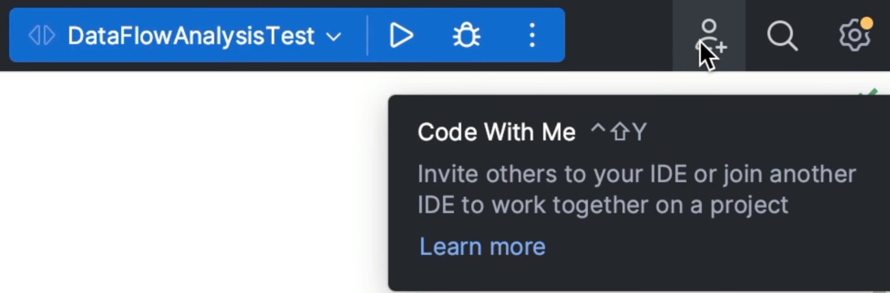
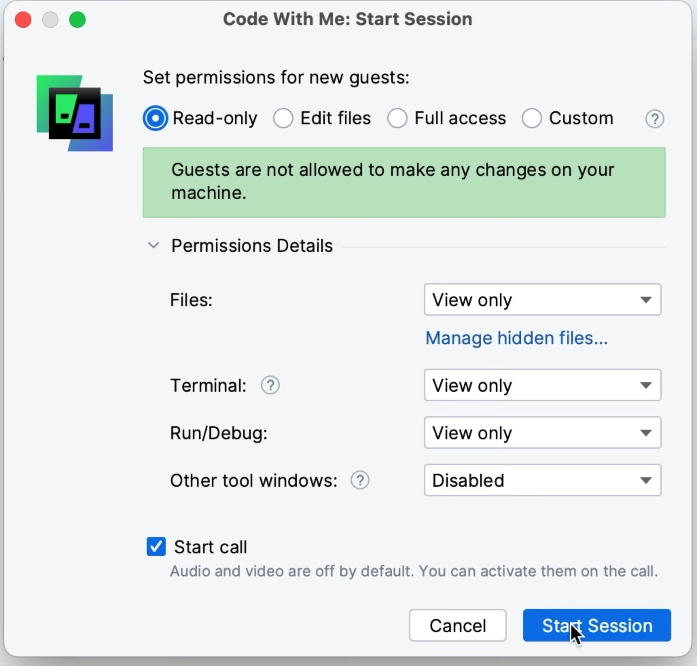

**This tutorial uses the new user interface throughout. You can access it from your Settings/Preferences (**⌘,** | **Ctrl+Alt+S**) and then search for "new UI". IntelliJ IDEA will then ask to restart and away you go!**

We often need to work collaboratively. We might not be located in the same physical space as our friends and colleagues and they might not have the IDE installed. [JetBrains Code With](https://www.jetbrains.com/code-with-me/) me is the solution to both of these challenges. Individuals can use Code With Me in IntelliJ IDEA Community Edition for up to 30 minutes and 3 guests for free. You can learn more about the licensing for [organisations](https://www.jetbrains.com/code-with-me/buy/#commercial) and [individuals](https://www.jetbrains.com/code-with-me/buy/#personal) from JetBrains. We will look at:

- Collaborating with others in the same instance of the IDE

## Collaborating with Others

<iframe width="560" height="315" src="https://www.youtube.com/embed/xaJ_nJJ-NX8" >
</iframe>

You can access Code With Me from the Main Toolbar by clicking the person icon and then selecting start session. Alternatively you can use **⌃⇧Y** (macOS) or **Ctrl+Shift+Y** (Windows/Linux). 

In reverse order, click **Join Session** to join a colleagues session if you have a link that they've sent you. Click **Permissions** to tweak the permissions for new Code With Me sessions, but you don't need to do this to start a new session as you get the same permission options each time you start a new Code With Me session.

Click **Start Session** to initiate Code With Me. 

You first need to choose from a predefined permission set using the options at the top, such as _Read-only_, and then you can tailor that permission set further if required. If you want to set custom permissions you can also do this using the _Custom_ option. For example, you might be working with someone who you want to be able to read your files, but you don't want them to be able to see your Terminal window. You can use the _Read-only_ permission set but change the **Terminal** option to _Disabled_.

Note the **Start call** checkbox at the bottom that is selected by default. Code With Me will start a call with audio, video and screen-sharing capabilities. All of these will be disabled by default and they will also be disabled when a new participant joins the call. 

When you click **Start Session**, IntelliJ IDEA will create a link that you can then share with others, even if they don't have the IDE installed. They can open the link in the browser, the terminal or paste it into IntelliJ IDEA using the **Join session** option in the Code With Me drop-down from the main toolbar. 

IntelliJ IDEA will create the session and notify you to approve participants as they join. Enjoy collaborative coding!