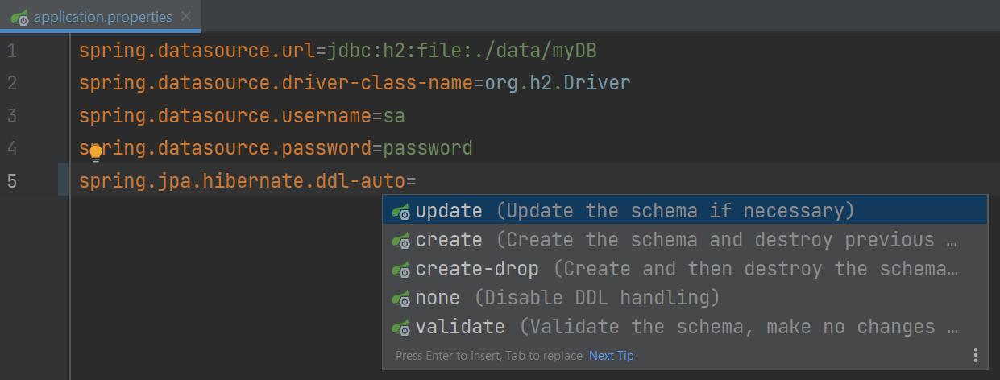

At this point, we can use the default in-memory database that Spring Boot creates for us. However, the default database functionality is limited and doesn't allow data to stay around after the application terminates so let's go ahead and configure a database.

We'll bring up the search menu (**Shift**+**Shift**) and search for our `application.properties` file. In our `application.properties` file, we can utilize IntelliJ IDEA's suggestions to specify the properties we need to connect to our [H2](https://www.h2database.com/html/main.html) database. We'll start typing `url` and choose the `spring.datasource.url` property from the list of suggestions.


If you're not using H2 as your database, you can specify your own database URL here. In our case, we will specify `dbc:h2:file:./data/myDB` as our URL which will create an H2 database called `myDB`.

Then, we need to specify our driver class name. We can similarly search for `driver` and choose `spring.datasource.driver-class-name` from our suggestions list. Once we select that, IntelliJ IDEA will suggest the H2 driver value based on the URL we specified earlier so we can select that.


Next, we'll similarly search for the `username` and `password` properties and set their values to `sa` and `password` respectively. 

Finally, we don't want to create any tables manually so we will add the `spring.jpa.hibernate.ddl-auto` property and use code completion to see a list of possible values.



For my application, I will set the property value to `update` which will create my tables in the database if they don't exist and update them if I make changes to my entities.

## End Result

Your `application.properties` file should look like this:

```
spring.datasource.url=jdbc:h2:file:./data/myDB
spring.datasource.driver-class-name=org.h2.Driver
spring.datasource.username=sa
spring.datasource.password=password
spring.jpa.hibernate.ddl-auto=update
```