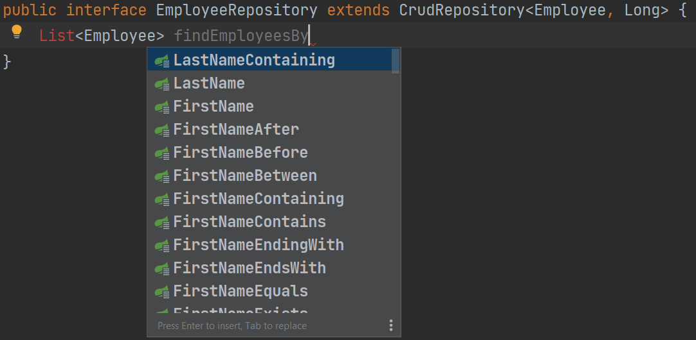

Now that we've created our Employee entity, we need a way to perform our CRUD (Create, Read, Update, Delete) operations. Luckily, Spring Data JPA provides all the basic operations through Repositories. Let's see how they work.

In the **Project** window, we'll select the `com.jetbrains.springdatajpaapp` package and press **Alt**+**Insert** for Windows/Linux or **⌘N** for macOS. Choose **Java Class**. We'll call it `EmployeeRepository` and this time we'll select **Interface** then press **Enter**. In order for our interface to be a repository, we'll need it to extend the `CrudRespository<T, ID>` interface with the generic parameters being our entity class and entity's id type. So for our application, our repository interface definition would be: `public interface EmployeeRepository extends CrudRepository<Employee, Long>`.

We will be using this `EmployeeRepository` interface to perform CRUD operations in our application code. Since we are extending `CrudRepository`, we get access to basic CRUD methods. For example, we can call the `save` method to insert an Employee object into our database. We could also call the `findAll` method to list all the Employees in your Employee table. We will see how to do this when we write our application logic. 

In most applications, you'll find yourself wanting to do more than what the `CrudRepository` interface provides for you by default.  For example, let's say we want to find all employees that have a space in their last name. You can certainly write a SQL query to do that. However, an easier way is to take advantage of Spring Data JPA which lets you create methods in your repository that will be translated into queries based on your method name. 

For example, let's say we want to add the method for finding all employees that have a certain string in their last name. We'll go to our `EmployeeRepository` interface and start declaring our method. My method will return a list of employees so we will use `List<Employee>` as our return type. Then, we need to specify a method name that has two parts: the introducer and the criteria. We can use **Ctrl**+**Space** in IntelliJ IDEA to see a list of method suggestions for the introducer:


We'll select `findEmployeesBy` for the introducer. Then, we will click **Ctrl**+**Space** again to see the list of criteria to choose from.



We'll select `LastNameContaining`. Finally, we'll declare a String method parameter representing the string that we want to check for. We now have a method that finds all employees with a last name containing the string provided. 

You might be thinking: if I've defined this interface, don't I have to implement it? The answer is no. Spring Data JPA takes care of that for you! All you need to do is define your Repository interface and declare your methods following the Spring Data conventions. As you're adding more methods, if you make mistakes in the method name, IntelliJ IDEA will point it out. For example, if we try to create a method for querying employees with an incorrect `LName` property, IntelliJ IDEA gives us an error saying `Cannot resolve property LName`.


## End Result

Your `EmployeeRepository` interface should look like this:
```java
package com.jetbrains.springdatajpaapp;

import org.springframework.data.repository.CrudRepository;

import java.util.List;

public interface EmployeeRepository extends CrudRepository<Employee, Long> {
    List<Employee> findEmployeesByLastNameContaining(String str);
}
```

