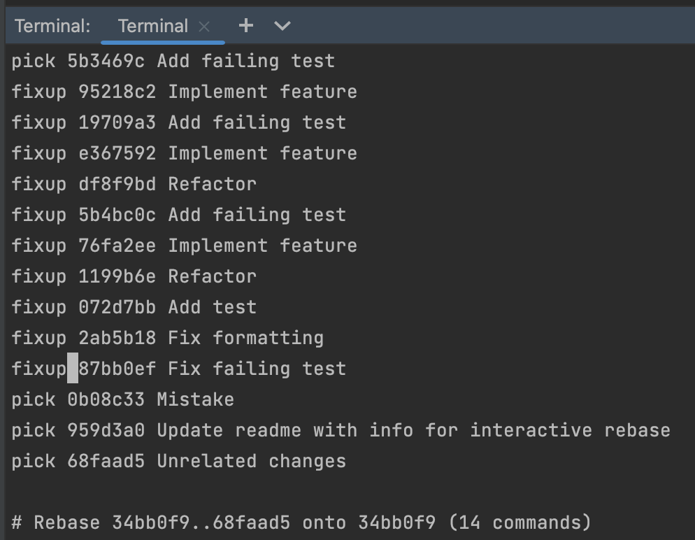

Let's take a look at how to use Git interactive rebase from the command line.

In the Git history, identify the commit _just before_ the commit from where you want to clean up your history. In this example, that will be the last commit before we started adding the new feature. 

Find the commit hash for this commit in the "**Commit Details**" to the right of the Git history in the Git window and copy this commit hash. (Spoiler: the commit hash in this example is `34bb0f99`.)

Open the Terminal window, using **⌥F12** on Mac (or **Alt+F12** on Windows & Linux) and type `git rebase -i 34bb0f99` (where `34bb0f99` is the commit hash we copied above).

This will open an editor in the terminal with the list of commits that were done on top of the selected commit. Each line in this file is an individual commit.

By default, Git will use whatever you have set as your default text editor. If you haven't set one, it will fall back to the vi editor, which is what we will use in this tutorial.

### Changing the order of the commits
Let's say we want to change the order of the commits; we want to keep the unrelated change, but separately from the changes for the new feature.
We can do so by changing the order of the lines (individual commits) to reflect the order we want.

In the editor in the terminal, switch to edit mode by pressing `I` to be able to edit this file.

We can change the order of the lines by removing the commit we want to move from the list and inserting it in the place where we want it. 

In vi, we can do so as follows:
* Place the cursor anywhere on the line you want to move (in this example the commit "Unrelated changes") and remove this line by typing `dd`.
* Move the cursor to the line where you want to reinsert this commit (in this example, the end of the file) and type `p`.
* Note: you do **not** need to switch to edit mode to do so.

Once we're sure about the order, we need to save the file. Press `esc` to exit edit mode and type `:wq` to save the file.
Note: If you made changes to the file that you do not want to save, type `:q!` to force quit.

The interactive rebase will be applied.

We see in the Git log that the order of the commits has changed.

### Combining multiple commits into one commit
Next, we want to combine multiple commits where we added the tests and implemented the new feature.  In the terminal, type `git rebase -i 34bb0f99` to start rebasing. If you have already run this command, you can press the up arrow `↑` in the terminal to show the last used command(s).

This will again open an editor in the terminal with the list of commits.

Switch to edit mode in the editor in the terminal. In vi, you can do so by pressing `I`.

For each of the commits we want to combine, replace "pick" with "fixup".

Note that we use "fixup" because we want to use one commit message for the combination of the commits. Alternatively, we could use "squash" to combine the individual commit messages into the new commit message.

Once we have correctly edited all the commits we want to combine, save the file.
In vi, press `esc` to exit edit mode and type `:wq` to save the file.
The interactive rebase will be applied. In the Git log, we can see that multiple individual commits are now combined into one commit with one commit message.

### Drop a commit
Finally, we want to drop the commit with a mistake that we made. In the terminal, type `git rebase -i 34bb0f99` to start rebasing. 

To drop a commit, remove that commit from the list of commits. In this example, we will remove the commit "Mistake".

In vi, we can remove a line by placing the cursor anywhere on the line we want to remove and typing `dd`.
Alternatively, we can switch to edit mode by pressing `I` and removing the line manually. 
Press `esc`to exit edit mode.

Save the file by typing `:wq` and the interactive rebase will be applied. We see in the Git log that the commit is dropped.

# Conclusion
Now we know how to clean up our commit history with Git interactive rebase from the command line.

Note that we can also combine several of these actions before we save the file to start rebasing. In this tutorial, we have chosen to do them one by one, for clarity.