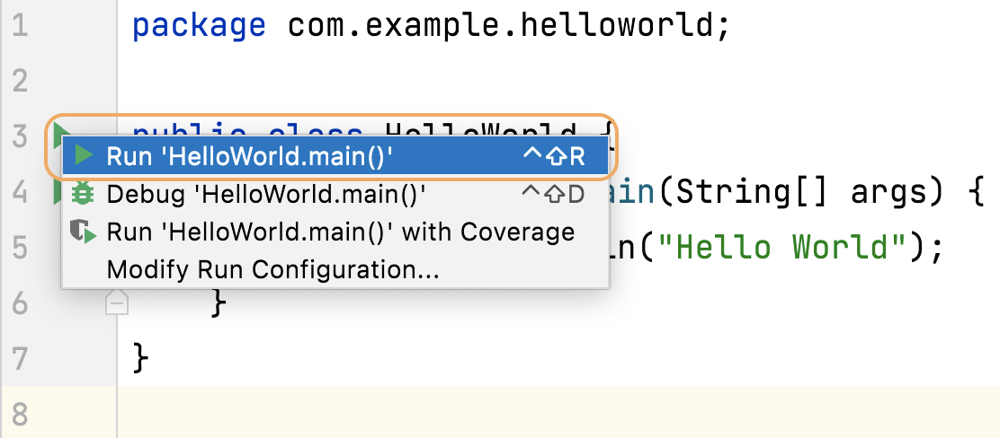
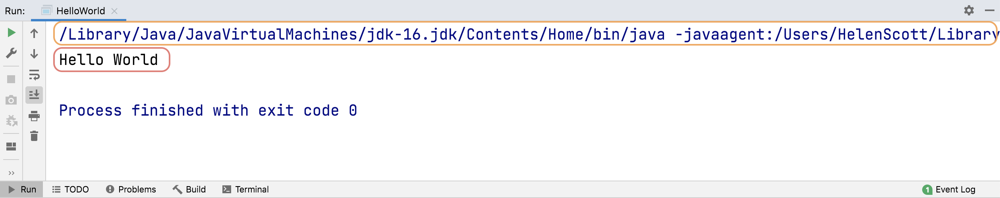
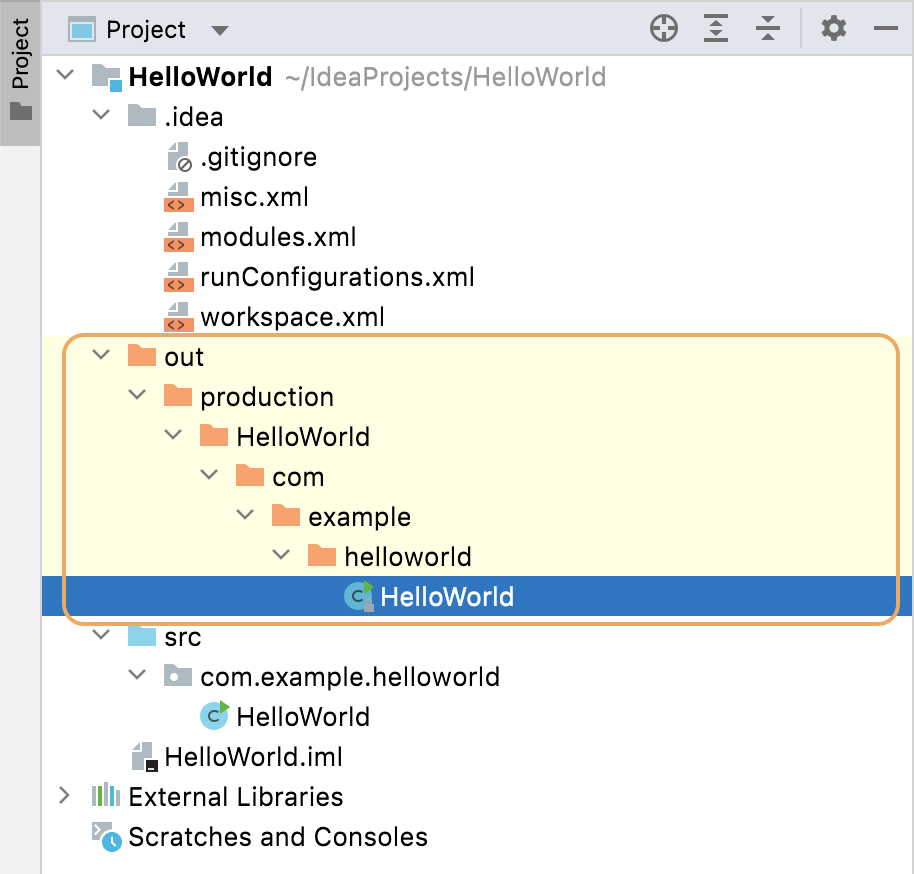
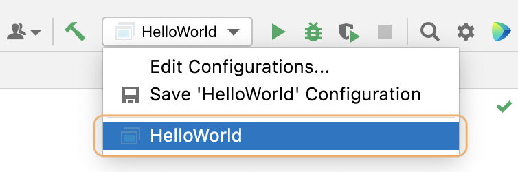

Now you have written your 'HelloWorld.java' class, you need to compile and run it. IntelliJ IDEA can do this for you. There are lots of ways you can run an application but to start with, you can click the green arrows to the left of the method. These are known as [gutter icons](https://www.jetbrains.com/help/idea/settings-gutter-icons.html). 

You'll notice that there are two green arrows. The top one is adjacent to the class, and it will run the class. Our class only contains Java's `main` method so that is all that it will run. However, if you're working with classes with multiple tests in for example, using this green run arrow will run all the tests in the class. 

The second green arrow is adjacent to Java's main method. Clicking this will run Java's main method. For the purpose of our application, both the green arrows do the same thing. When you click on the green arrow you'll get different options including debug, but we will just run it for now so select that option.

IntelliJ IDEA will now compile the file into a class file and then run it. The output of the run is shown in the Run tool window at the bottom of your screen. 

### The Run Window

Let's take a look at your Run Window in more detail.

The first line shows the command that was used to run the program. We don't usually need to worry about what this was, but it's useful to know in case you want to see exactly what was run and how. For example, if you scroll to the right you will see `com.example.helloworld.HelloWorld`. This tells you that it was your HelloWorld class that was run. You can also see exactly which JDK was used, which can be useful if you have multiple versions of Java on the same machine.

The second line in this window is the output of your program - the "Hello World" statement that you told it to print.

The last line, which says `Process finished with exit code 0` shows the program ran without an error. 

### What IntelliJ IDEA Created

Let's take a quick look at what happened when you ran the application. IntelliJ IDEA compiled your HelloWorld.java file into a class file. By default, the IDE created a folder called `out`. Production code, meaning code that isn't test code, is put into the `production` folder within the `out` folder. IntelliJ IDEA creates a folder for our `HelloWorld` project and then the directory structure for our package. The compiled class file `HelloWorld.class` can be found at the end of this directory hierarchy.

### Run Configurations and Shortcuts

IntelliJ IDEA also created a [run configuration](https://www.jetbrains.com/help/idea/run-debug-configuration.html) for the application we ran. If you want to, you can run or debug any run configurations from the [navigation bar](https://www.jetbrains.com/help/idea/guided-tour-around-the-user-interface.html#navigation-bar). We will take a more detailed look at run configurations later in this tutorial.

If you want to go back to the Run Window, you can use **Cmd**+**4** on macOS, or **Alt**+**4**  on Windows to open it and the same shortcut again to close it and return the focus back on the editor. 

---

### Video of Steps