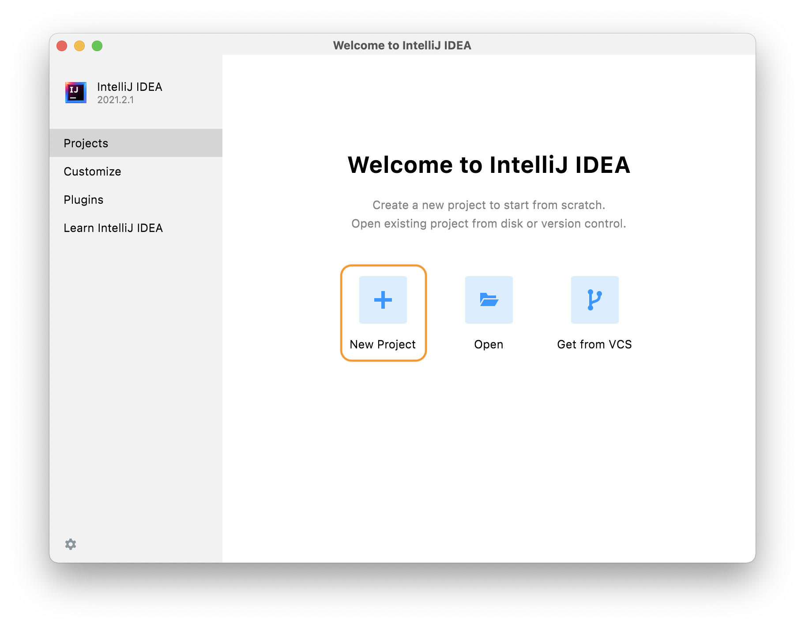
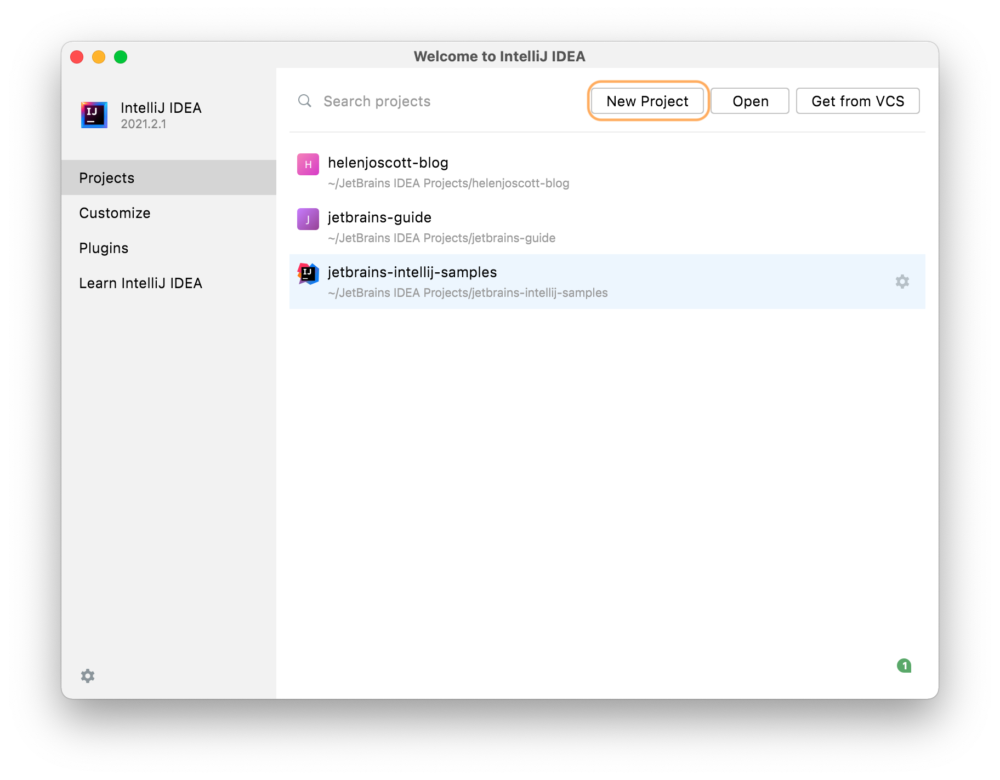
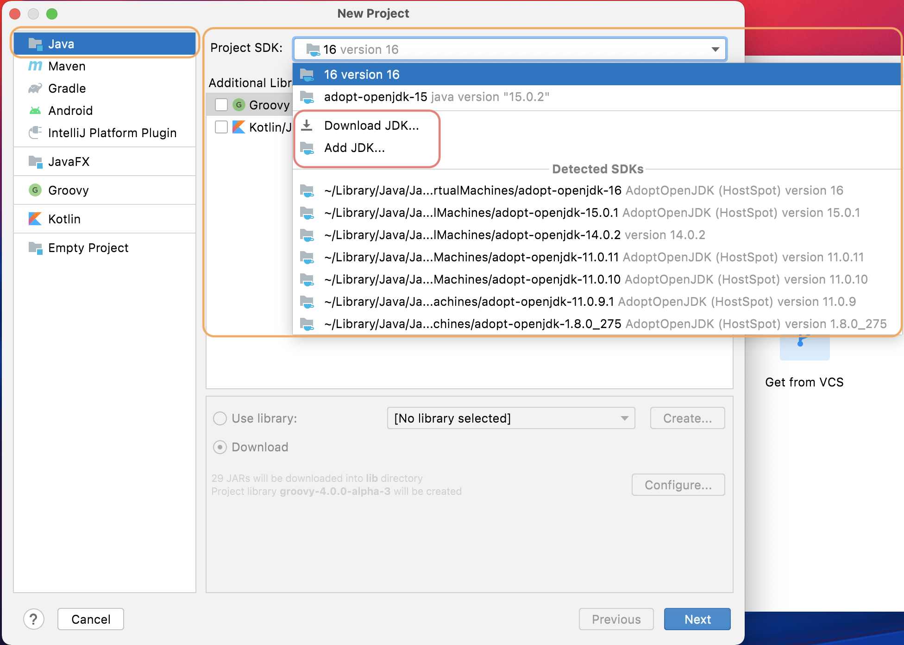
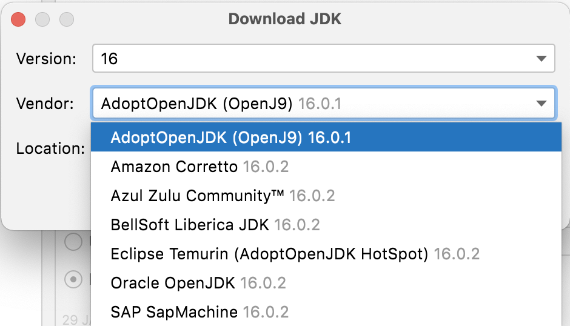
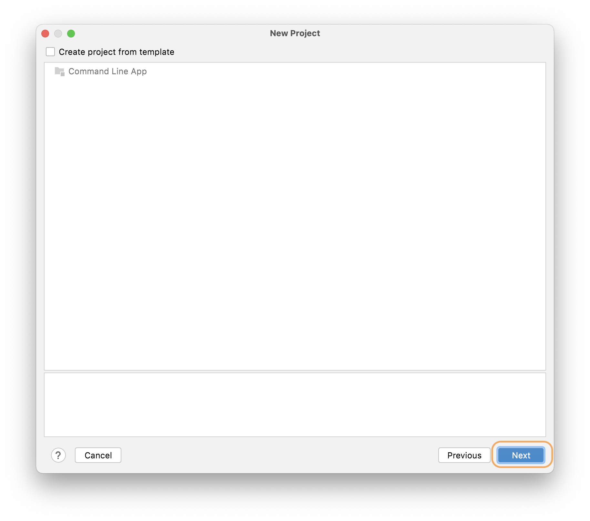
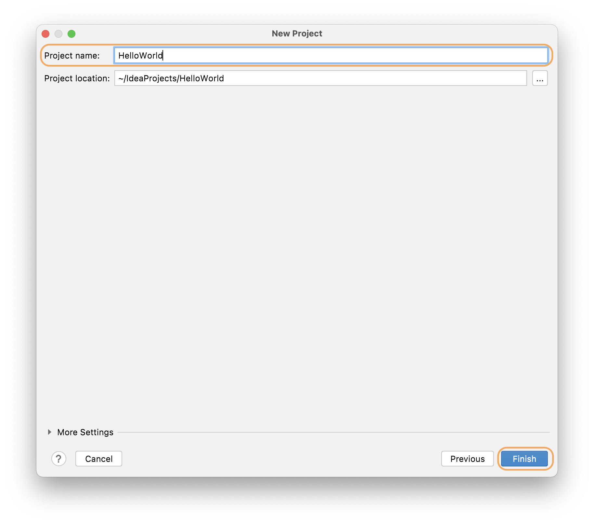

## Creating your HelloWorld Project

In this walk-through, we will create, run and package a simple Java application that prints "hello world" to the system output. We will see some IntelliJ IDEA features that can boost our productivity. For example, coding assistance and supplementary tools. All the features in this tutorial are available in both IntelliJ IDEA Community edition and IntelliJ IDEA Ultimate.

1) You can use the New Project Wizard to create a new Project inside IntelliJ IDEA. From the Welcome screen you can click **New Project**, or, if you're already inside a project, you can go to **File** > **New** > **Project**. 

If you haven't opened a project before, the **New Project** option is in the Welcome screen:

If you have previously opened a project, the **New Project** button will be on the top bar.

2) We want to create a Java project which is selected by default. We need to select a JDK for compiling this project from the Project SDK drop-down:

IntelliJ IDEA shows us a list of configured JDKs at the top of the list as well as a list of JDKs it's detected on our machine. We can select any of them, or we can click **Download JDK**. 

Java is packaged and provided by a number of different vendors. This list shows some of the most common ones. Open JDK is Oracle's free, open JDK build, which will always be the latest version. If we pick another vendor, for example, Adopt Open JDK, we can see all the available versions. 

This tutorial doesn't need the latest version of Java so feel free to select the one you're most comfortable with. Finally, if you want to use a JDK that's on your machine, but hasn't been detected by IntelliJ IDEA, you can use **Add JDK** to browse to it.

The IDE will spend a bit of time downloading and installing the Java development kit if you opted to download a JDK. You don't need to do any additional configuration once it's downloaded, IntelliJ IDEA handles that for you. 

3) We're not going to use any additional libraries or frameworks for this tutorial so let's click **Next**
4) We could create a project from a template, but we're going to do everything from scratch for this tutorial, so click **Next**.

   

5) We'll call this project _HelloWorld_. You could change the default project location if you want to, but the default is fine for this tutorial. 

   

6) Click **Finish** so IntelliJ IDEA can create your project. 

