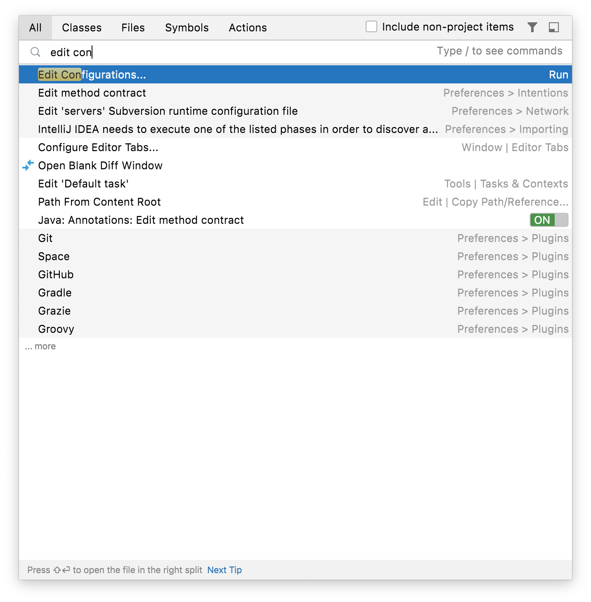
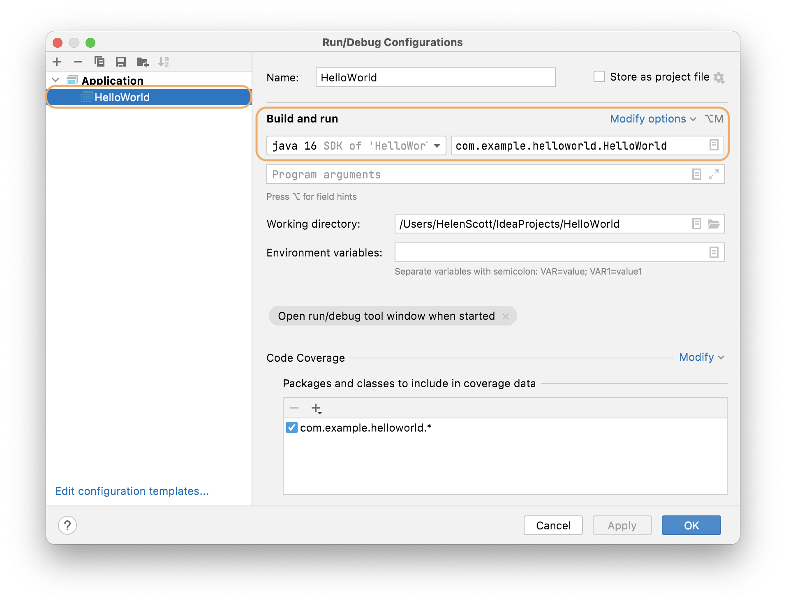
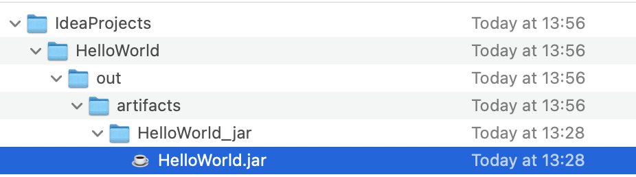
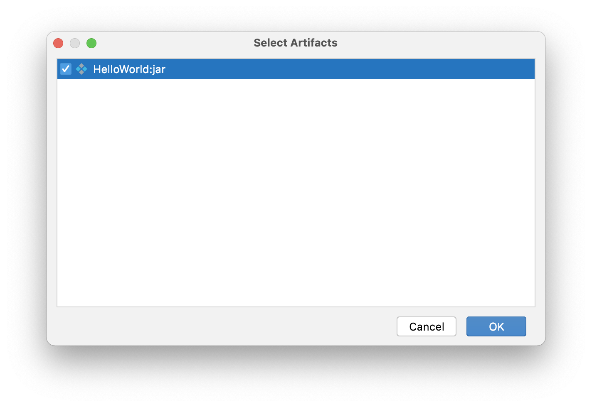
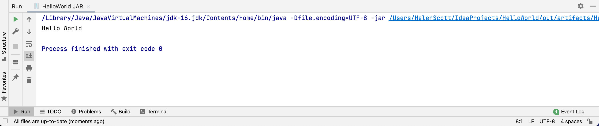

Now you've created your JAR file, you need to run it to check that the behaviour is the same as running your main method in your `HelloWorld.java` file. To run your Java application as a JAR, you can create a new [run configuration](https://www.jetbrains.com/help/idea/run-debug-configuration.html). 

1) Press **Shift** twice to use [search everywhere](https://www.jetbrains.com/idea/guide/tips/search-everywhere/). If you don't know a shortcut in IntelliJ IDEA, search everywhere is a great way to search for what you need. In this instance, you want to create a new run configuration, so type into the dialog _edit configurations_.

2) When the correct option appears you can use the arrow keys to select it and press **Enter**. 

 

3) In the run configuration dialogue, you can see the run configuration that IntelliJ IDEA automatically created for running the main method in our HelloWorld.java class. 

4) Let's create a new configuration for running our new JAR file. You can do that by pressing the **+** button and select _JAR Application_ from the list.

5) First, give your new run configuration a name such as `HelloWorld JAR` so you can tell the difference between this one and the one that IntelliJ IDEA created earlier. 

6) Click on the browse button for the **Path to the JAR**. You need to navigate to your JAR file. Remember it's in the output for your project. 

7) Scroll down to the **Before launch** section at the bottom of the dialog. Press **+** here and select _Build Artifacts_ from the drop-down list.

 

8) Select and choose your `HelloWorld.jar` artifact and press **OK**. This means IntelliJ IDEA will rebuild your `HelloWorld.jar` file before we run this configuration. 

9) Press **OK** again to save the new run configuration. Your new run configuration is now displayed in the [navigation bar](https://www.jetbrains.com/help/idea/run-debug-configuration.html) by default.

If you press the black drop-down arrow adjacent to the _HelloWorld JAR_ run configuration, you can see both your _HelloWorld_ original run configuration and the new one we just created. Let's run your new _HelloWorld JAR_ configuration to see if it works. Press the green arrow to the right of the run configuration with _HelloWorld JAR_ selected in the drop-down. 

You should get same "Hello World" output as you did from running the class file.

This proves that it works the way we expected. However, how do you know this is running your JAR file and not simply your class file? 

If you look in the [Run window](https://www.jetbrains.com/help/idea/run-tool-window.html), you can see that IntelliJ IDEA is using the `-jar` argument to run the JAR file. It also shows the full path to a `HelloWorld.jar` file.

`../IdeaProjects/HelloWorld/out/artifacts/HelloWorld_jar/HelloWorld.jar`

Beforehand, it showed the fully qualified class name, including the package. You can be confident that your new run configuration did run your `HelloWorld.jar` that you created. Finally, let's check that your JAR file is being rebuilt each time you use the run configuration that we created as we configured it to do. We will do this in the next step of this tutorial by making a change to our class file and checking the output.

---

### Video of Steps