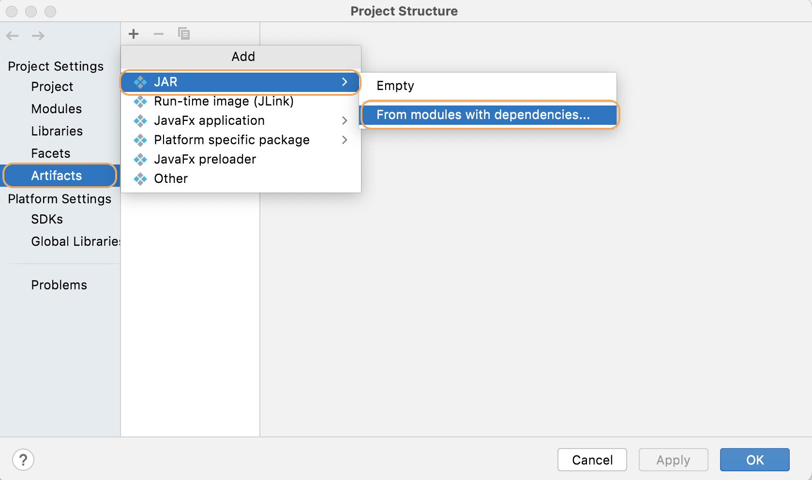
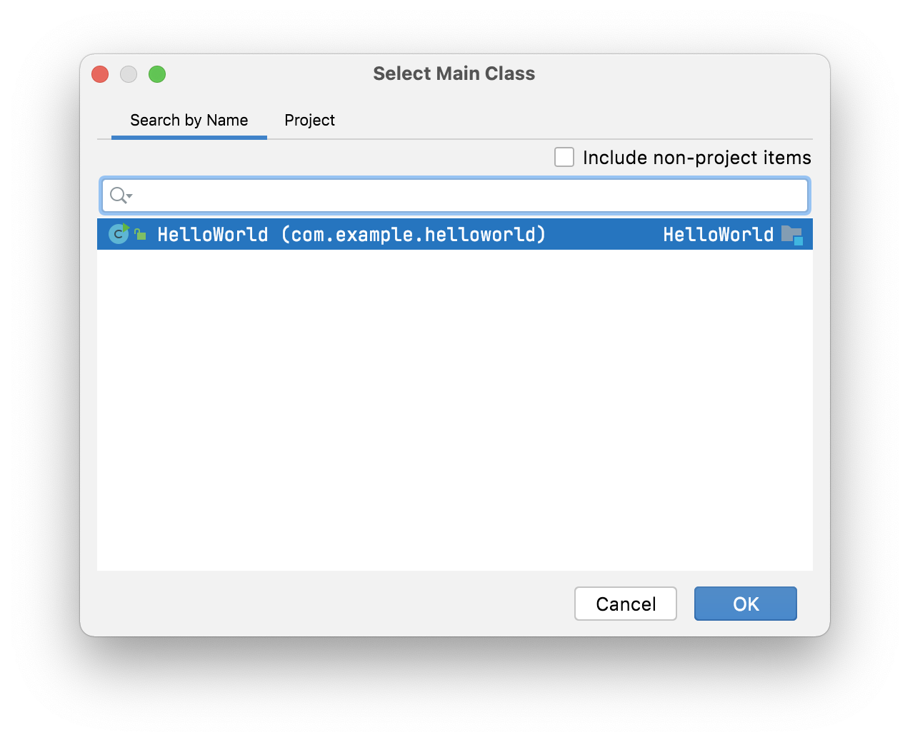
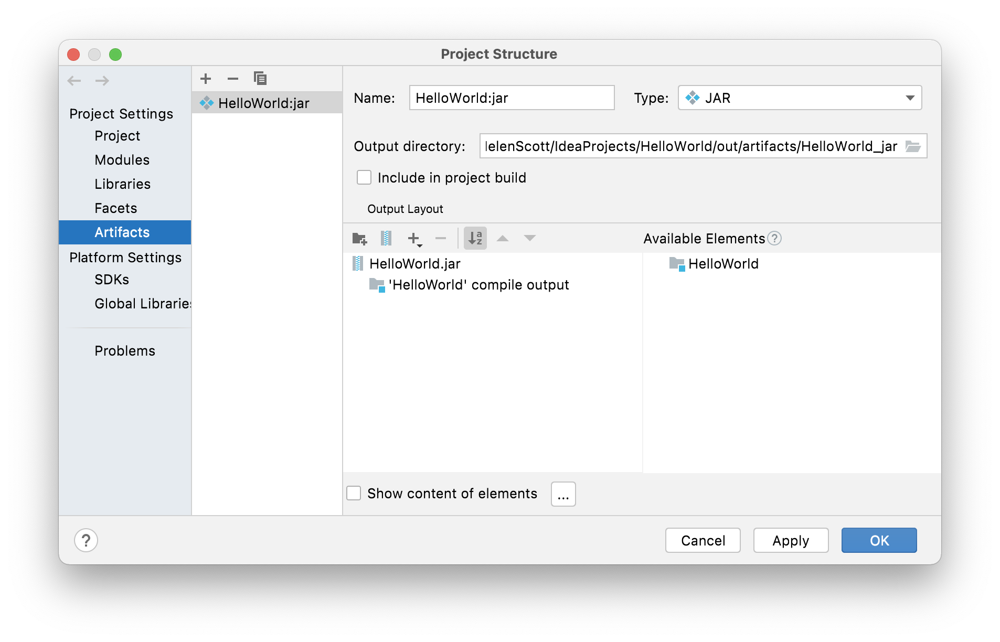
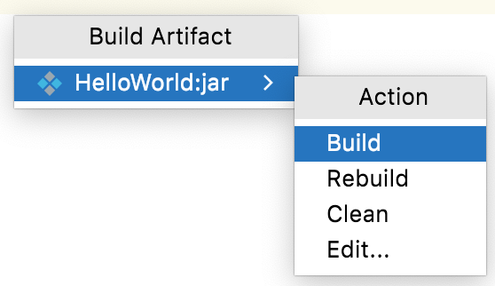
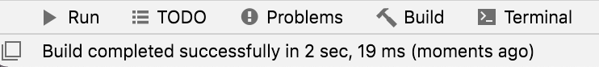
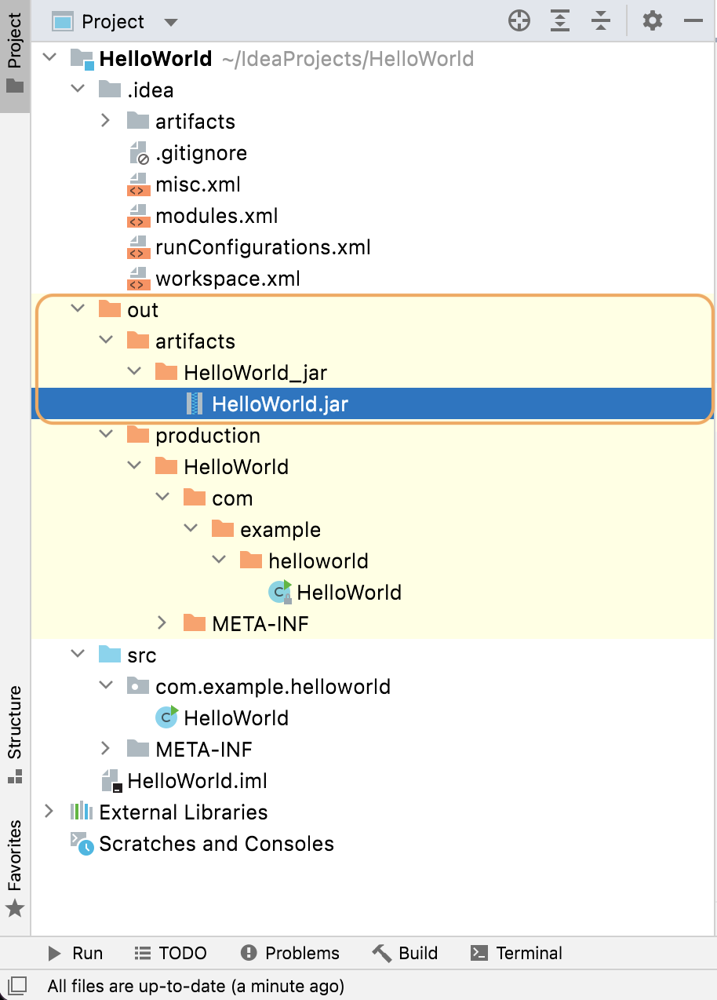

## Packaging our Application in a Java Archive File (JAR)

When the code is ready, we can [package our application in a Java archive](https://www.jetbrains.com/help/idea/compiling-applications.html#package_into_jar). JAR files are often used to deploy an application to the production server. Once a JAR file has been built, it is called an artifact. Let's take look at how to create artifacts in IntelliJ IDEA. 

### Creating an Artifact

1) Press **Cmd+;** on macOS, or **Shift+Control+Alt+S** on Windows to bring up the [Project Structure](https://www.jetbrains.com/help/idea/project-structure-dialog.html) dialog.
2) Select **Artifacts** from the left-hand menu and then click the **+** icon. Select **JAR** and then **From modules with dependencies**. 

You don't need to change anything for the Module, however you do need to say which class in our project has the main method. Click the browse button to navigate to your main method. IntelliJ IDEA shows as a list of classes in your project, you only have one so select that one. 

3) Click **OK** to select your class. All of the other defaults are fine for this tutorial, press **OK**. Now we can see our new JAR file defined in the Project Structure dialog. 

4) If it looks okay, press **OK**. You have now defined how to build the JAR file, but we haven't actually built it yet. We need to go to build it with our build artifacts.
5) Go to **Build** > **Build Artifacts**. We only have one to choose from which is the one that we just defined.

6) Press **Enter** to build the artifact. Your status bar at the bottom-right of the screen will show you when this has completed. 

IntelliJ IDEA puts the artifact in your artifacts in a new folder in your `out` folder called `HelloWorld_jar`. 

To make sure that this JAR file was created correctly we can run it. We should see the same output as with our Java file. We'll do this in the next step of this tutorial.