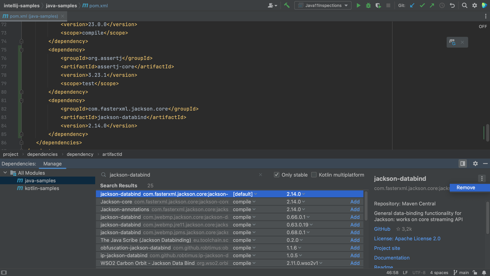

Finally, we can remove dependencies we no longer need. In the Dependencies tool window, let's remove jackson-databind from the Java module. We select the dependency we want to remove (jackson-databind) and in the Dependency details pane on the right, click the **More** button (three dots) and select **Remove**.

We will see that the dependency is removed from the pom.xml and the dependency list. To remove a dependency from the whole project, select **All Modules** on the left.
