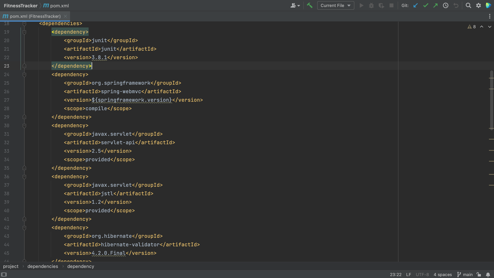
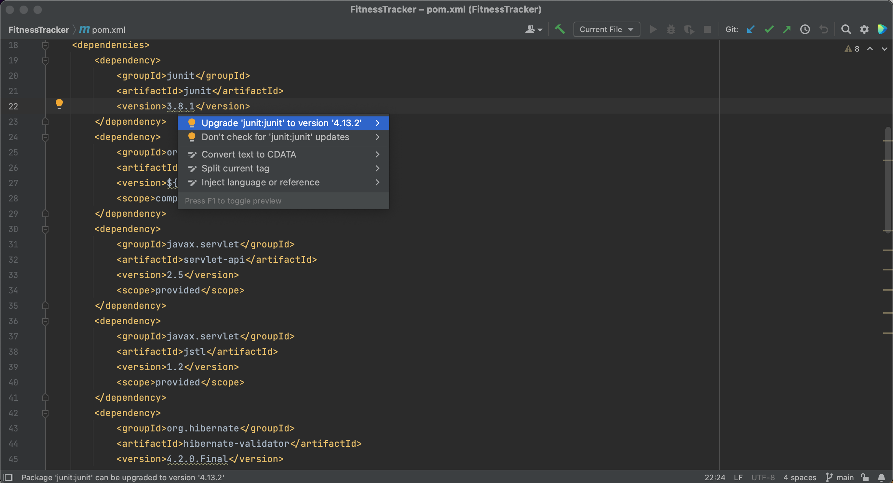
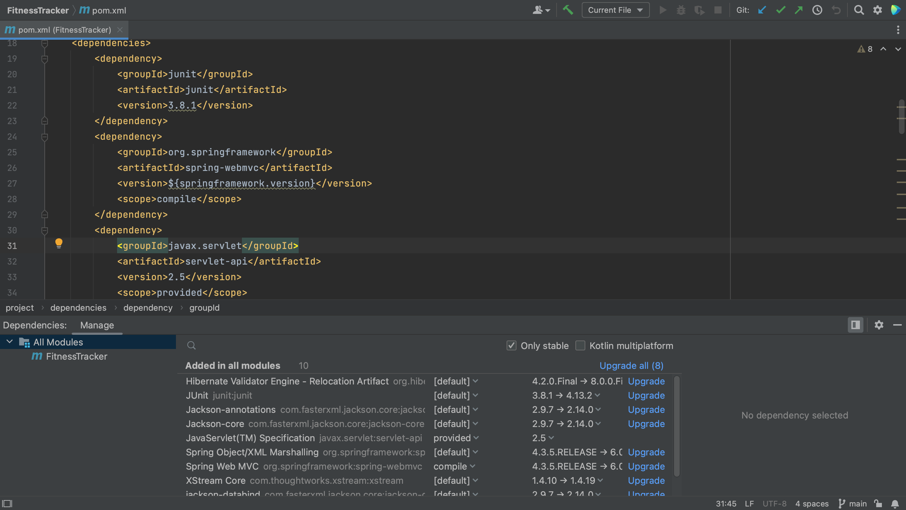
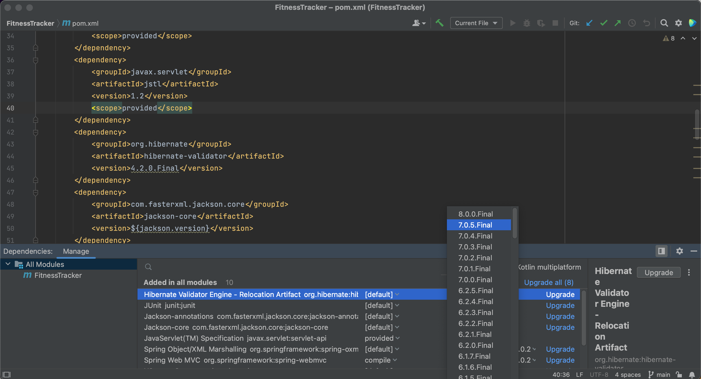
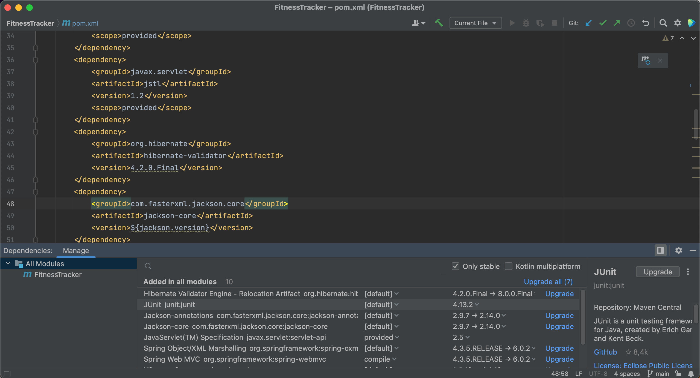
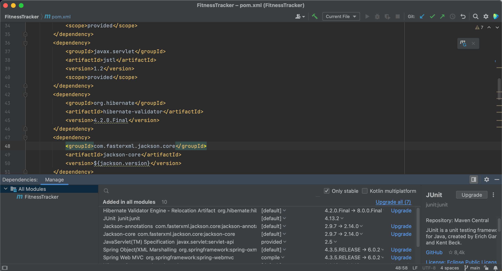

We will also need to keep our dependencies up to date. To show you how IntelliJ IDEA can help, we are using this extremely outdated project as an example. In the pom.xml below, we see that several dependencies are marked with squiggly lines underneath them. 

IntelliJ IDEA will show the suggestion to upgrade when we hover over the dependency, and we can click the suggestion to upgrade the dependencies.

Alternatively, we can use Context Actions **⌥⏎** (on macOS) or **Alt+Enter** (on Windows & Linux) to upgrade these dependencies.

We can also upgrade our dependencies using the Dependencies tool window. The Dependencies tool window will tell us if there’s a newer version of a dependency, as we can see here. 

We can choose the version to upgrade to by clicking on the version number in the list. Note that we don’t have to use the latest version.

We can also automatically upgrade a dependency to the latest version by clicking **Upgrade** for that particular dependency.

Or, we can even upgrade all our dependencies at once, by clicking the **Upgrade all** link.

