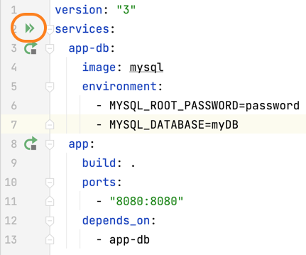

Since you're reading this, you probably need to transition your application from Java EE to Jakarta EE. If you want the history on this change, check out [this helpful blog post](https://blogs.oracle.com/javamagazine/post/transition-from-java-ee-to-jakarta-ee) from Java Magazine. Fundamentally the Java Persistence API was renamed to Jakarta Persistence API meaning that the `javax` namespace changed to `jakarta` for frameworks whose APIs have moved to Jakarta EE.

Tomcat recently moved from version 9 to 10 and in that change updated package names from `javax` to `jakarta`. SpringBoot also made [this change](https://spring.io/blog/2021/09/02/a-java-17-and-jakarta-ee-9-baseline-for-spring-framework-6) in version 6.

We're going to work with some sample code which you can get [from GitHub](https://github.com/helenjoscott/MyWebApp), thanks to [Dalia](https://twitter.com/DaliaShea) for creating the project! There are three branches in this project; *main*, *javax* and *jakarta*. Clone the project from GitHub if you want to and check out the `javax` branch, we will start here. 

If you are following along, download and run the code with **⌃R** (macOS), or **Shift+F10** (Windows/Linux). Alternatively you can use the run icon in the gutter of the`docker-compose.yml` file:

Now you should be able to navigate to [localhost:8080/MyWebApp](localhost:8080/MyWebApp) and see the application. If you enter a name and fruit they should successfully be persisted to the database. This application is currently running Tomcat 9.0 which uses the `javax` namespace. 