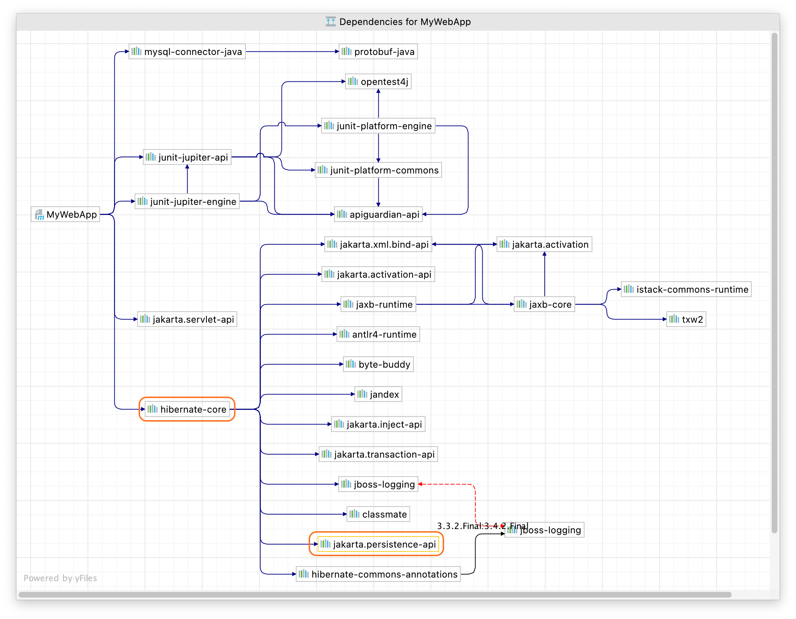

The first thing we need to do is update our dependencies. This project uses Maven so that's our `pom.xml` file. If you're using Gradle you need to update your `build.gradle` file.

Look for the following dependencies:

```xml
<dependency>
   <groupId>javax.servlet</groupId>
   <artifactId>javax.servlet-api</artifactId>
   <version>4.0.1</version>
   <scope>provided</scope>  
</dependency>
<dependency>
   <groupId>org.hibernate</groupId>
   <artifactId>hibernate-core</artifactId>
   <version>5.6.3.Final</version>
</dependency>
```

The first step is to replace the dependency for `javax.servlet` with `jakarta.servlet`:

```xml
<dependency>
   <groupId>jakarta.servlet</groupId>
   <artifactId>jakarta.servlet-api</artifactId>
   <version>5.0.0</version>
   <scope>provided</scope>
</dependency>
```

However, the `org.hibernate` dependency has a transitive dependency on `javax.persistence-api` as well which is part of the old Java Persistence API so this also needs to be updated.

As a side note, you can see this dependency in IntelliJ IDEA Ultimate by right-clicking on the dependency name and selecting **Show Dependencies** or **⌥⌘U** (macOS), **Ctrl+Alt+U** (Windows/Linux). 



Since we want to move from the `javax` to `jakarta` namespace in our application, we need to update the dependency on `org.hibernate` to a version that supports the `jakarta` namespace. Unfortunately at time of writing, Hibernate is not currently compatible with Jakarta Persistence API 3.0, but there is a beta version we can use.

We need to change the version number here:

```xml
<dependency>
   <groupId>org.hibernate</groupId>
   <artifactId>hibernate-core</artifactId>
   <version>5.6.3.Final</version>
</dependency>
```

To this beta version:

```xml
<dependency>
   <groupId>org.hibernate</groupId>
   <artifactId>hibernate-core</artifactId>
   <version>6.0.0.Beta3</version>
</dependency>
```

Next, we need to reload our `pom.xml` file with **⇧⌘I** (macOS), or **Ctrl+Shift+O** (Windows/Linux), or click the little Maven icon . 

Now open your Project window with **⌘1** (macOS) or **Alt+1** (Windows/Linux) and note that your two Java files are underlined in red because they are in an error state. Let’s fix that next.
