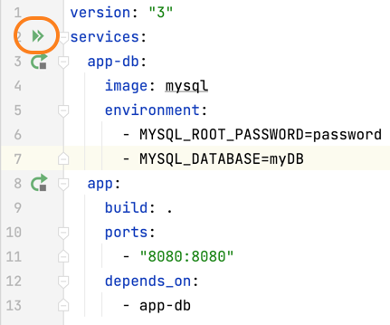
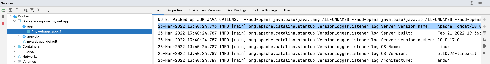

This project uses Docker so you can update the version of Tomcat from 9 to 10 in your `Dockerfile`:

```dockerfile
FROM tomcat:9-jdk17
ADD target/MyWebApp.war /usr/local/tomcat/webapps/MyWebApp.war
EXPOSE 8080
CMD ["catalina.sh", "run"]
```

Now your `Dockerfile` will look like this: 

```dockerfile
FROM tomcat:10-jdk17
ADD target/MyWebApp.war /usr/local/tomcat/webapps/MyWebApp.war
EXPOSE 8080
CMD ["catalina.sh", "run"]
```

Before we start the migration from `javax` to `jakarta` let's run our project to see the error we need to fix. You can run your project with **⌃R** (macOS), or **Shift+F10** (Windows/Linux). Alternatively you can use the run icon in the gutter of the`docker-compose.yml` file adjacent to services because we want the image to be rebuilt:



You can check the logs for your container to ensure you're running Tomcat 10.0 in the Services window with **⌘8** (macOS), or **Alt+8** (Windows/Linux).



`2022-03-23T13:40:24.787157700Z 23-Mar-2022 13:40:24.776 INFO [main] org.apache.catalina.startup.VersionLoggerListener.log Server version name:   Apache Tomcat/10.0.17`

Now we're confident that we're using Tomcat 10.0, let's go to the webserver front end and see what happens. In your browser go to [localhost:8080/MyWebApp](localhost:8080/MyWebApp) and try to enter a name and fruit - you will get a 404 error. We're getting this error because Tomcat 9 used Java Servlet 4.0 which uses `javax.*` and Tomcat 10 uses Jakarta Servlet 5.0 which uses `jakarta.*`. Let's fix the problem now!