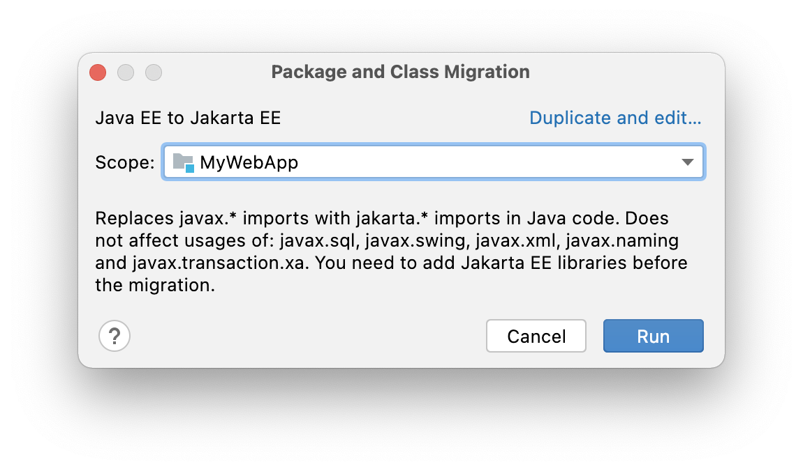
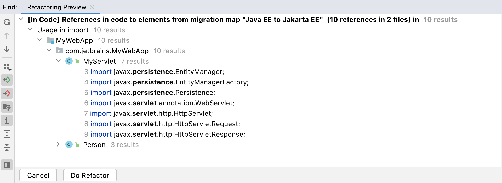

One common question you might have at this stage is "why don't I just do a find and replace for `javax` to `jakarta`?" The answer is that not all `javax` packages have been migrated to the `jakarta` namespace. For example, `javax.transaction.xa` package is not going to be using Jakarta.

We're going to use IntelliJ IDEA's migration tool which was introduced in IntelliJ IDEA 2021.2 for the next steps. From the menu, navigate to **Refactor** > **Migrate Packages and Classes** > **Java EE to Jakarta EE.**

You can select the scope here, for example *MyWebApp*. This also allows you to go module by module if you’re working with a larger more realistic application. Press *Run** to get a preview of the refactorings.

Press **Do Refactor**. Your Java classes should no longer be in a state of error. Now let's rebuild our application with **⌘F9** (macOS), or **Ctrl+F9** (Windows/Linux) and then run it with **Shift**+**F10** |**⌃R**.

Now you should be able to navigate to [localhost:8080/MyWebApp](localhost:8080/MyWebApp) again and see the application. Your error should be gone and your migration is nearly complete.