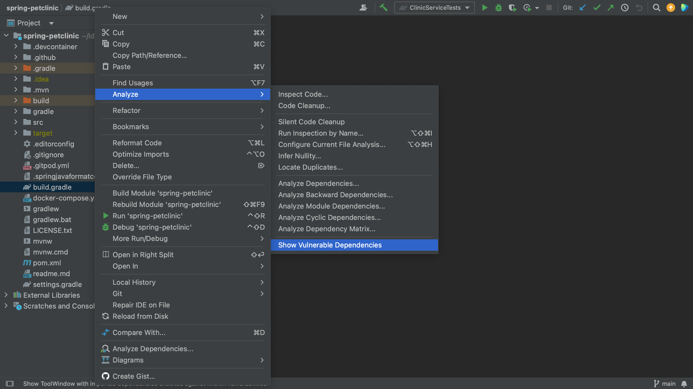
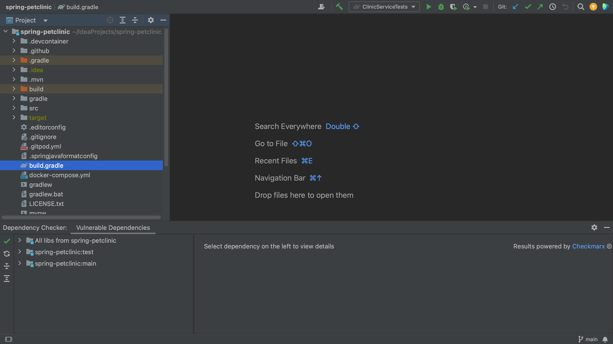

In a Gradle project, all of your project's dependencies are declared in the build.gradle. When we open the build.gradle file for a project which contains vulnerable dependencies, we see that several dependencies are highlighted.

We can open the Vulnerable Dependencies tool window from the build.gradle file. For example, let's have a look at the [Spring PetClinic](https://github.com/spring-projects/spring-petclinic), which uses Gradle. We can right-click the build.gradle file and go to **Analyze** > **Show Vulnerable Dependencies**. This will open the Vulnerable Dependencies tool window.

