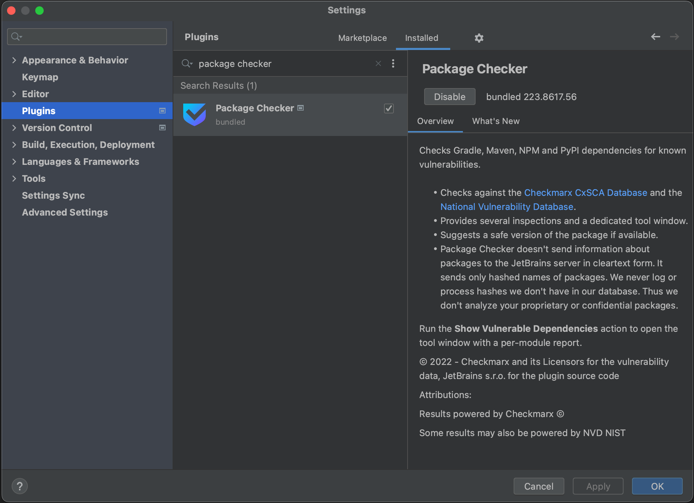

In this tutorial, we're going to take a look at the Package Checker plugin, that's bundled with IntelliJ IDEA Ultimate. We'll have a look at how to view known vulnerabilities in your Maven or Gradle projects, how to get more information about the known vulnerabilities in a specific dependency and how to remediate these vulnerabilities inside IntelliJ IDEA Ultimate if a new version with a fix is available.

