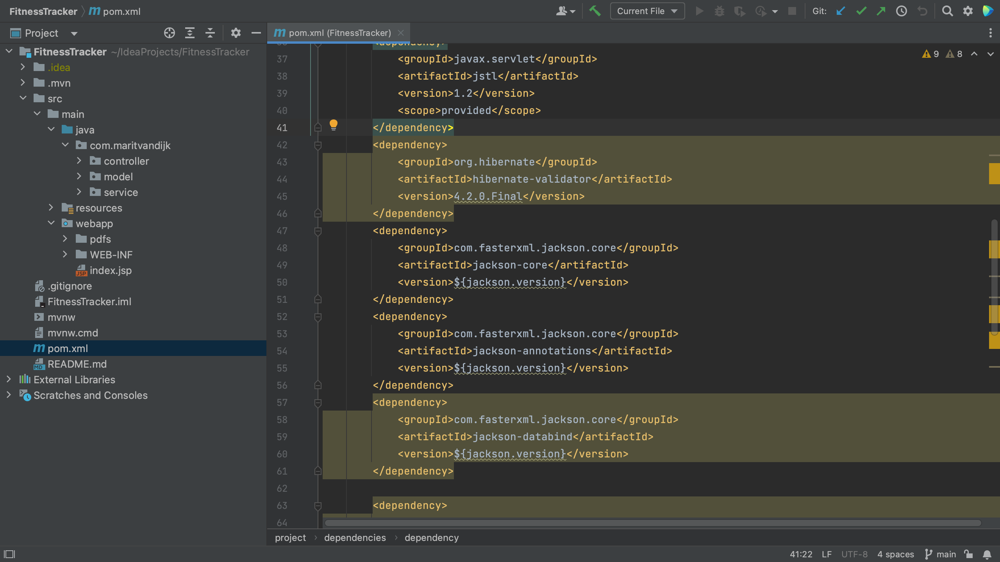

There are several ways to view known vulnerabilities for the dependencies to your project.

In a Maven project, all of your project's dependencies are declared in the pom.xml. When we open the pom.xml file for a project which contains vulnerable dependencies, we see that several dependencies are highlighted. 

The Package Checker plugin highlights vulnerable dependencies and when we hover over the highlighted dependency, IntelliJ IDEA Ultimate shows all the vulnerabilities that were identified in this particular dependency. When we click on link for the CVE for a particular vulnerability, we're redirected to the Checkmarx Advisory to learn more about this specific vulnerability.

Another way to see all the vulnerable packages is by right-clicking on the pom.xml file and selecting **Analyze** > **Show Vulnerable Dependencies**. This will open the Vulnerable Dependencies tool window.

