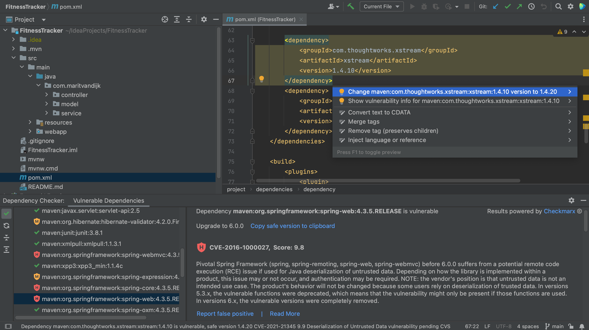

Finally, we can remediate these vulnerabilities. We can click **Copy safe version to clipboard** in the Vulnerable Dependencies tool window details pane to copy the safe version and paste it into our build file.

We can also fix it directly in our build file. When we hover over a specific vulnerable dependency, the hover menu includes an action that we can click to upgrade the version (if a new version is available).

Alternatively, we can use the intention action shortcut, **⌥ ⏎** on MacOs, or **Alt+Enter** on Windows/Linux and select the action to upgrade the version (if a new version is available).

After we update the versions, we can **Load Maven Changes**, using **⌘⇧I** on MacOs or **Ctrl+Shift+O** on Windows/Linux. We see that the overview in the Vulnerable Checker tool window is updated, and we see that dependencies that we have upgraded and are no longer vulnerable are removed, or shown with a green checkmark if we have enabled **Show safe** dependencies.

