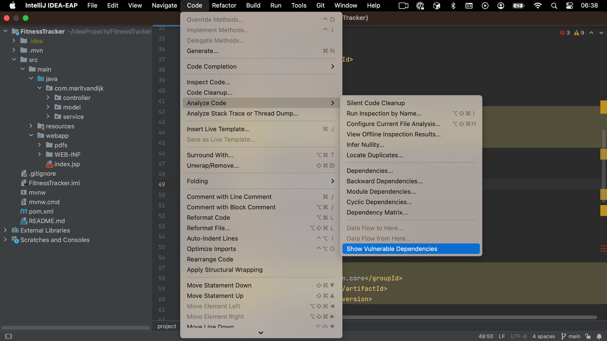
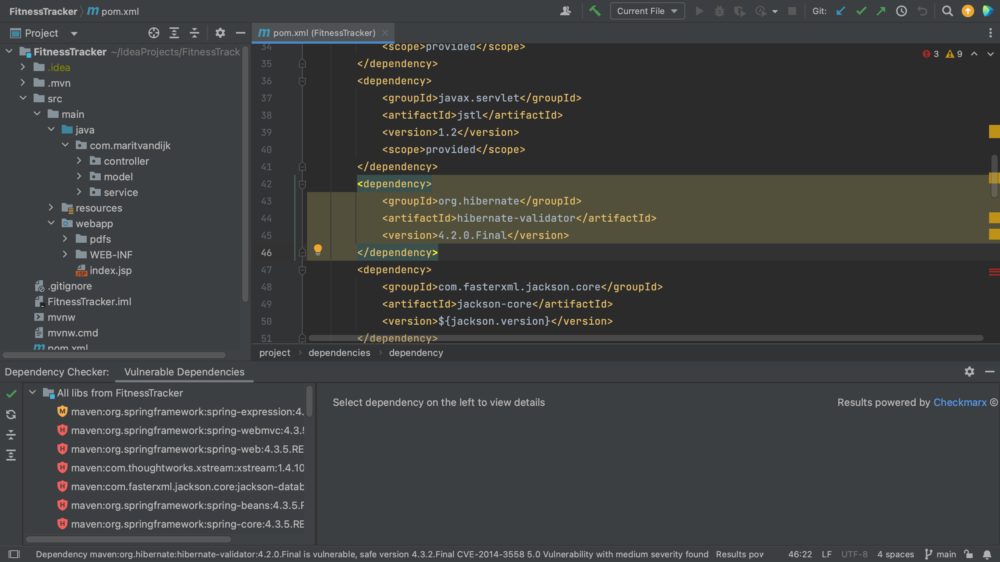
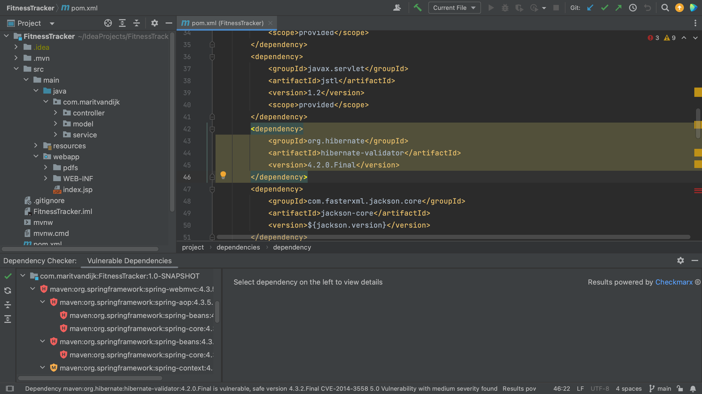
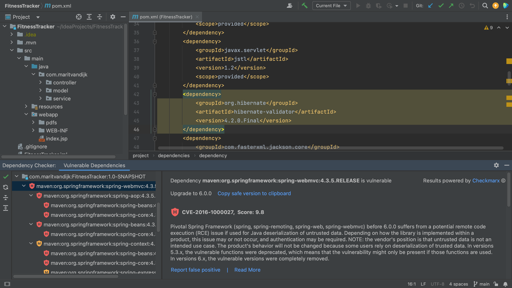
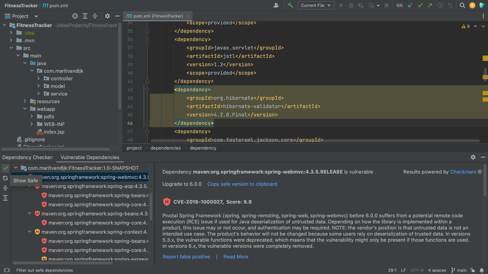
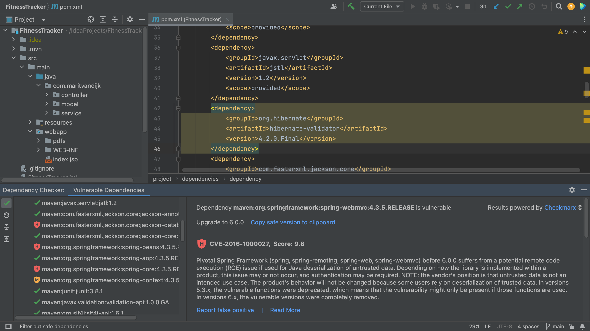

We can also open the Vulnerable Dependencies tool window without having to open the files where our dependencies are declared. To open the Vulnerable Dependencies tool window straight from the main menu, go to **Code** > **Analyze Code** > **Show Vulnerable Dependencies**.

The Vulnerable Dependencies tool window shows all the vulnerable dependencies for the project. For each vulnerability, we can see an indication of the severity. There are two different views; the **flat view** shows all the vulnerable dependencies in this project and the **dependency hierarchy view** shows the dependency tree and the hierarchy between dependencies. 

When we click a specific dependency, we can see more information about the vulnerabilities that were found in that dependency. In the Vulnerable Dependencies tool window details pane on the right, we can click the link to **Read more** under the information about a particular dependency, which will take us to the information about this specific vulnerability in the Checkmarx Advisory.

To see all the dependencies of the project regardless of whether they're vulnerable or not, we can click the **Show safe** button on the top left of the Vulnerable Dependencies tool window. 

The dependencies without known vulnerabilities are shown with a green checkmark next to it. We still have the same two views; the **flat view** and the **dependency hierarchy view**. We can use the **Show safe** button to toggle between showing all dependencies or vulnerable dependencies only. We can use the **Collapse all** or **Expand all** buttons to collapse or expand the views.

