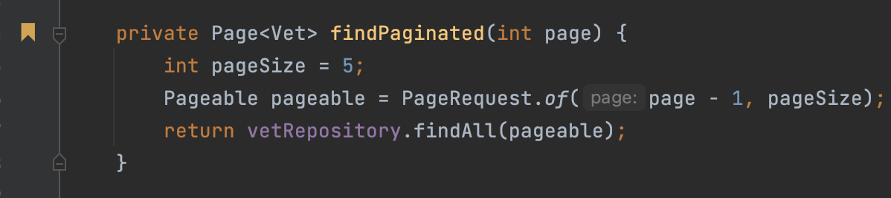
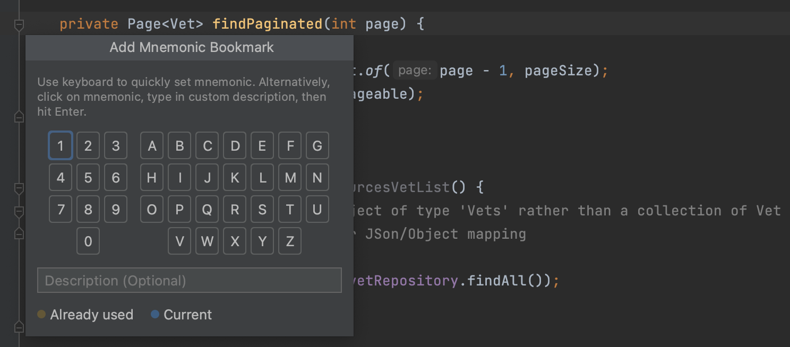
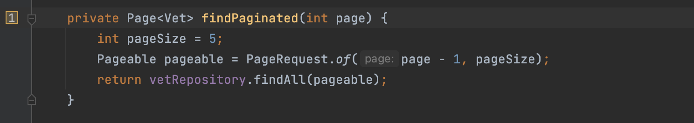
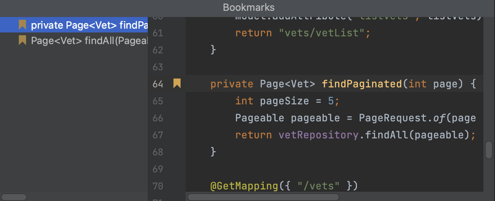

Another way to navigate through code, is to use bookmarks. Press **F3** (on Mac) or **F11** (on Windows/Linux) to create an anonymous line bookmark. 

To add a mnemonic line bookmark, press **⌥ F3** (on Mac) or **Control+F11** (on Windows/Linux). In the popup that opens, select a number or a letter that you want to use as an identifier for this bookmark. Press **⏎** (on Mac) or **Enter** (on Windows/Linux) to save the bookmark. To bookmark files, packages, folders, and modules, right-click the item you want to bookmark in the **Project Tool Window**, and add an anonymous bookmark (**F3** (on Mac) or **F11** (on Windows/Linux)), or a mnemonic bookmark (**⌥ F3** (on Mac) or **Control+F11** (on Windows/Linux)).

There are several ways to navigate between bookmarks. Press **⌘ F3** (on Mac) or **Alt+F2** (on Windows/Linux) to open a popup showing bookmarks and select the desired bookmark with the keyboard and press **⏎**, or select the corresponding digit or letter for a mnemonic bookmark.

To jump straight to a mnemonic bookmark, hold **^** (on Mac) or **Control** (on Windows/Linux) and press the mnemonic digit or letter on the keyboard.
