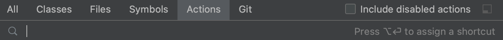

If you want to do something, but don't remember the shortcut or menu option, use **Find Action**.
Press **⇧⌘A** (on Mac) or **Control+Shift+A** (on Windows/Linux) to open the **Find Action** dialog. Search for the action you want, and select the relevant action.

For example, let's use **Find Action** to apply soft-wrap.
