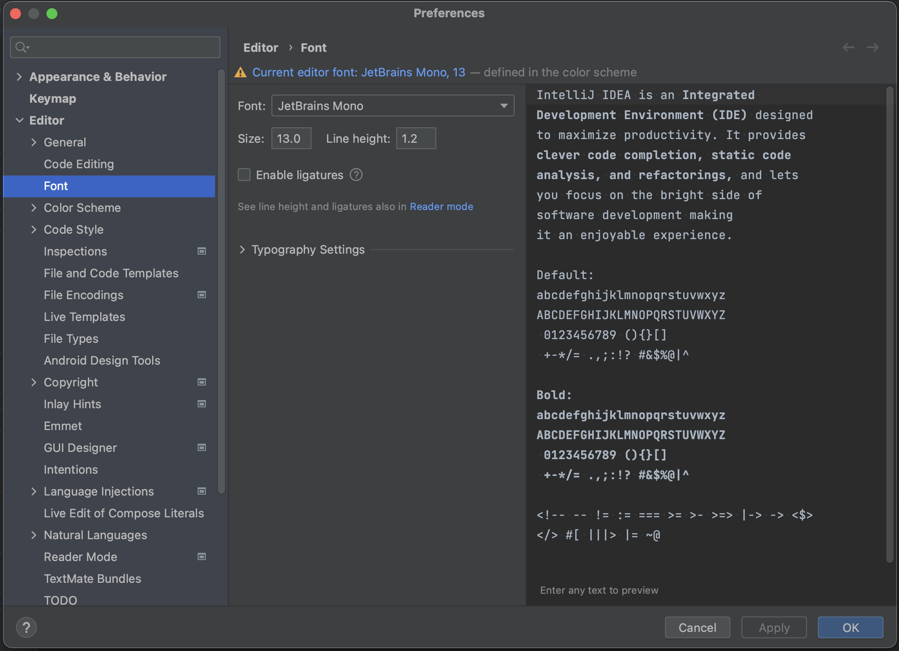

To configure font and font size, go to **Preferences > Editor > Font**. We can select the font we want to use, and set the font size.

When presenting in person, make sure the font can be read from a distance. If possible, check out the room where you'll be speaking, do your setup before your talk, and walk to the back of the room to check if the code is readable.
